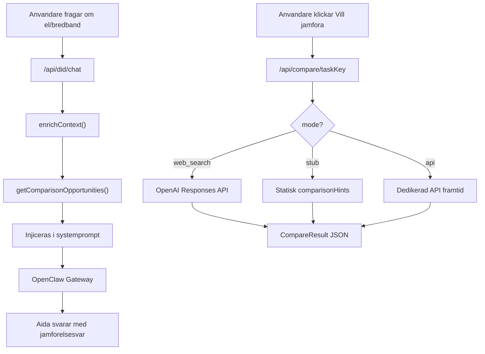

# Jamforelsemotor: 5 aktiva + 3 stubbade fran befintlig checklista

## Nulage

- 3 aktiva jamforelser via OpenAI web_search: `electricity_contract`, `broadband_order_install`, `home_insurance`
- 8 av 23 checklistmoment har redan `comparisonHints` i [lib/checklist/template.ts](lib/checklist/template.ts)
- Kod i [lib/comparison/compare.ts](lib/comparison/compare.ts), route i [app/api/compare/[taskKey]/route.ts](app/api/compare/[taskKey]/route.ts)
- Feature flag `WEB_SEARCH_COMPARE=y` i `.env`

## De 8 befintliga momenten med comparisonHints

- `electricity_contract` — El (rorligt/fast, paslag, bindningstid) -- **redan aktiv**
- `broadband_order_install` — Bredband (pris, bindningstid, router) -- **redan aktiv**
- `home_insurance` — Hemforsakring (bostadstyp, sjalvrisk, drulle) -- **redan aktiv**
- `movers_or_trailer` — Flyttfirma (timpris/fast, forsakring, omdomen)
- `cleaning_service` — Flyttstadning (pris, garanti, vad som ingar)
- `storage_gap` — Magasinering (m3, klimatkontroll, forsakring)
- `broadband_tech_check` — Teknik pa nya adressen (leverantorer, installation, Wi-Fi 6)
- `mail_forwarding` — Eftersandning post (langd, pris, vad som ingar)

## Andringar

### 1. Aktivera 5 med web_search, stubba 3

**Aktiva (web_search via OpenAI Responses API):**

- `electricity_contract` — El (redan aktiv, utoka prompt med elnatsomrade)
- `broadband_order_install` — Bredband (redan aktiv)
- `home_insurance` — Hemforsakring (redan aktiv)
- `movers_or_trailer` — Flyttfirma (NY — lagg till i SUPPORTED_TASKS)
- `cleaning_service` — Flyttstadning (NY — lagg till i SUPPORTED_TASKS)

**Stubbade (returnerar statisk comparisonHints-text, ingen web_search):**

- `storage_gap` — Magasinering
- `broadband_tech_check` — Teknik pa nya adressen
- `mail_forwarding` — Eftersandning post

Varje task far ett falt `mode: "web_search" | "stub" | "api"`. Stubb-tasks returnerar hints fran checklistan utan OpenAI-anrop. Nar dedikerad API finns andras mode till `"api"`.

### 2. Elnatsomrade-logik

Ny fil `lib/comparison/elarea.ts` med postnummer-prefix till elomrade (SE1-SE4):

- SE1: Lulea (prefix 87-98)
- SE2: Sundsvall (prefix 80-86)
- SE3: Stockholm (prefix 10-19, 30-49, 50-79)
- SE4: Malmo (prefix 20-29)

Injiceras i el-jamforelsens prompt + exponeras i enrichment-kontexten.

### 3. Uppdatera IDENTITY.md

I [claw/config/agents/aida-flyttagent/agent/IDENTITY.md](claw/config/agents/aida-flyttagent/agent/IDENTITY.md):

- Jamforelseverktyg: vilka taskKeys, aktiva vs stubbade
- Hur presentera resultat (sammanfattning + leverantorer, naturligt sprak)
- Proaktivt erbjuda jamforelse nar toCity ar ifyllt
- Elnatsomrade fran postnummer

### 4. Uppdatera DID-chatprompt

I [app/api/did/chat/route.ts](app/api/did/chat/route.ts) `buildSystemMessage()`:

- Sektion om jamforelsesystemet
- Instruktion for "jamfor bredband" / "vilken el ar billigast"
- Referera jamforelseresultat nar de finns i kontexten

### 5. Env-variabler

I `.env`:

- `COMPARE_TASKS_ENABLED=electricity_contract,broadband_order_install,home_insurance,movers_or_trailer,cleaning_service`
- Befintliga `WEB_SEARCH_COMPARE=y` och `COMPARE_MODEL` behalles

### 6. Uppdatera assistantTools

I [lib/openclaw/server-config.ts](lib/openclaw/server-config.ts):

- `compareLiveKeys`: de 5 aktiva
- `compareStubKeys`: de 3 stubbade
- Alla 8 i `compareSupportedKeys`

## Dataflode

## Avgransning

- Ingen UI-andring i checklistan (den visar redan comparisonHints inline)
- Inga nya moment laggs till i checklist-template (behalles pa 23)
- Inga nya partner-API:er — bara infrastruktur for att latt byta till dem

