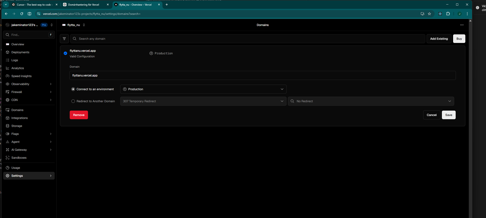
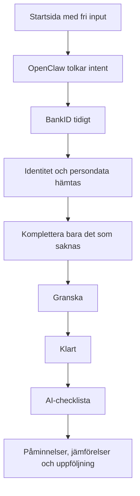
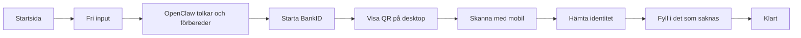
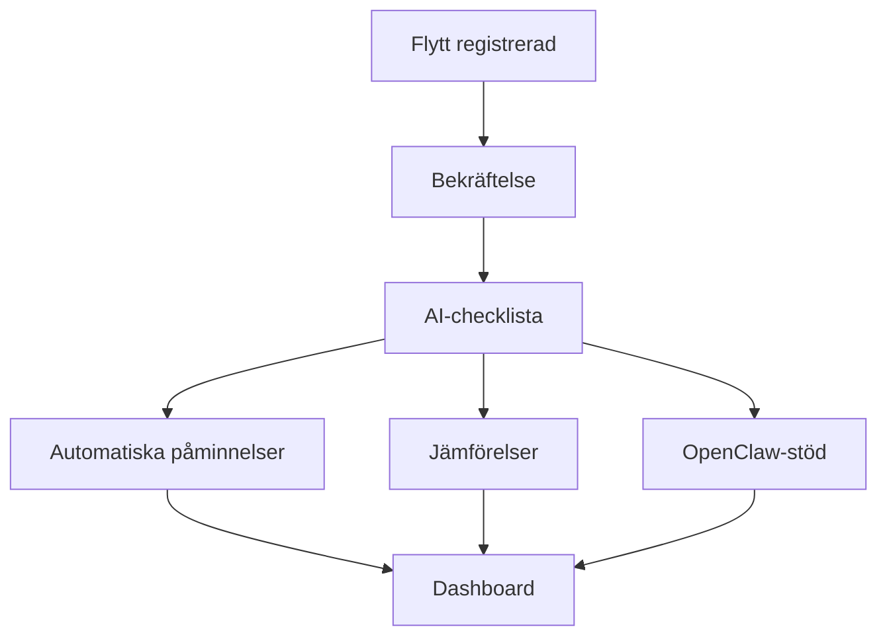

# Flytt.io - Samlad masterplan

> Det här dokumentet samlar allt i ett enda underlag: vad chefen vill, vad vi vill behålla, vad som redan fungerar bra i nuvarande lösning och vilka beslut vi har tagit för nästa version av `flytt.io`.

---

## 1. Syfte

Målet är att ta fram en enklare, tydligare och mer modern version av `flytt.io` utan att kasta bort det som redan fungerar i projektet.

Den nya sidan ska:

- kännas mer förtroendeingivande
- bli enklare att förstå direkt
- leda användaren snabbare till ett klart resultat
- använda AI och `OpenClaw` på ett mer värdeskapande sätt
- behålla backend, dataflöden och befintliga integrationer

Kort sagt:

**ny publik upplevelse, samma motor**

---

## 2. Vad chefen har önskat

Utifrån chefens material och den riktning vi tolkat från wireframen är det här de viktigaste önskemålen:

### Kärnvision

- sidan ska kännas som den riktiga `flytt.io`
- uttrycket ska vara modernare, lugnare och mer sammanhållet
- användaren ska komma snabbt mot ett klart resultat
- `Skatteverket` och `BankID` ska ligga nära kärnan
- sidan ska inge trygghet, enkelhet och officiell känsla

### Produktmässigt

- officiell flyttanmälan till `Skatteverket`
- trygg identifiering med `BankID`
- kort väg till klar registrering
- ett tydligt eftervärde efter flytten
- checklista, påminnelser, uppföljning och jämförelser som del av erbjudandet

### Visuellt

- behåll den visuella riktningen från chefens underlag
- använd marin mörk ton, mintgrön accent och BankID-blå
- undvik ett stökigt eller övertekniskt uttryck
- använd ett lugnare, mer premium och mer editorial formspråk

### Affärsmässigt

- checklistan ska vara ett tydligt värdelöfte
- AI ska gärna vara med som modernt värdeord
- det ska gå att sälja in tjänsten som något smartare än bara en flyttanmälan

---

## 3. Vad du vill behålla

Det här är det du tydligt har velat bevara i lösningen:

### Från produkten

- flyttcheckkollen / checklistan
- jämförelsespåren
- `OpenClaw`
- `DID`-agenten
- den nuvarande backendstrukturen
- all befintlig datalagring
- API:erna och det som redan fungerar i systemet

### Från upplevelsen

- AI som tydligt värdeord
- en modern känsla
- ett smart första steg på startsidan
- att användaren snabbt ska kunna komma vidare mot `BankID`
- att viktiga uppgifter ska hämtas så tidigt som möjligt

### Från innehållet

- checklistan som säljande värde redan på första sidan
- automatiska påminnelser
- jämförelser och uppföljning
- möjliga besparingar, exempelvis `2 mån gratis el`
- idén om bred nytta efter flytten, exempelvis allt från nätverksleverantör till lokal vardagsnytta

---

## 4. Vad som redan fungerar bra idag

Vi har redan mycket som är värt att behålla.

### I frontend

- startsidan är redan modulärt uppdelad
- adressändringsflödet finns redan
- dashboarden finns redan
- checklista och efterflöde finns redan i någon form

### I backend och API

Det finns redan fungerande eller viktiga kontrakt för:

- `POST /api/move`
- `GET /api/move`
- `POST /api/checklist/template`
- `GET/POST /api/compare/[taskKey]`
- `POST /api/openclaw/chat`
- `POST /api/ai/autofill`
- `POST /api/ai/validate`
- `POST /api/skv/int7/start`
- `GET /api/skv/int7/status/[jobId]`
- `GET /api/skv/clone/state/[jobId]`
- `GET /api/skv/clone/qr/[jobId]`

### I produkten

- data sparas redan
- checklista kan redan genereras
- jämförelser finns redan
- `OpenClaw` finns redan
- SKV/BankID-spår finns redan
- dashboard och uppföljning finns redan

### Slutsats

Det är alltså **inte** logiskt att börja om från noll tekniskt, eftersom mycket av den svåra infrastrukturen redan finns.

---

## 5. Vad som inte fungerar lika bra idag

Det nuvarande publika uttrycket upplevs som för spretigt och för effekttungt jämfört med den riktning vi vill mot.

### Problem i nuvarande uttryck

- videobakgrund i hero
- för många animationer samtidigt
- visuellt brus
- för showig "techdemo"-känsla
- för många lager som konkurrerar med huvudbudskapet

### Konsekvens

Användaren riskerar att förstå att sidan är avancerad, men inte att den är enkel.

Det strider mot huvudmålet, som är:

- snabb förståelse
- snabb start
- snabb väg till klart resultat

---

## 6. Huvudbeslut

Det samlade beslutet är:

### Vi ska inte

- bygga ett helt nytt tekniskt frontendspår
- kasta bort befintlig backend
- kasta bort dataflöden, checklistor, jämförelser eller dashboard

### Vi ska

- göra en tydlig redesign av den publika upplevelsen
- bygga om startsidan kraftigt
- förenkla adressändringsresan
- få in `BankID` tidigt i resan
- låta `OpenClaw` vara med från början
- låta checklistan vara ett tydligt löfte redan på första sidan

Kort sagt:

**behåll systemet, bygg om fasaden**

---

## 7. Roller i lösningen

Det är viktigt att skilja mellan olika delar av den intelligenta upplevelsen.

### `OpenClaw`

`OpenClaw` ska vara:

- backendhjärnan bakom registreringsresan
- intelligenslagret som förstår användarens input
- stödet som avgör nästa bästa steg
- motorn bakom hjälp, logik och formulärförståelse

`OpenClaw` är alltså inte bara en chattfunktion. Den ska vara en central del av produktens intelligens.

### `DID`-flyttagenten

`DID`-agenten ska vara:

- det visuella ansiktet utåt
- guiden som hjälper användaren om problem uppstår
- ett mänskligare lager ovanpå det smarta backendstödet

Den ska inte ersätta flödet, utan lotsa användaren genom det.

### `BankID`

`BankID` ska:

- komma in så tidigt som möjligt
- användas för att minska manuell inmatning
- hjälpa oss att få upp viktiga personuppgifter tidigt
- stärka känslan av trygghet och officiell hantering

---

## 8. Hur startsidan ska fungera

Startsidan ska inte längre bara vara en klassisk hero med allmän text. Den ska fungera som ett faktiskt första steg.

### Första intrycket ska bära fyra saker samtidigt

#### 1. Huvudlöftet

- officiell flyttanmälan
- snabbt till klart resultat

#### 2. Tryggheten

- `Skatteverket`
- `BankID`
- trygg hantering av personuppgifter

#### 3. AI-värdet

- AI-checklista
- AI-hjälp
- smart uppföljning

#### 4. Eftervärdet

- påminnelser
- jämförelser
- möjliga besparingar

### Fri input på startsidan

Det ska finnas ett tydligt första inputfält där användaren kan skriva fritt, exempelvis:

- ny adress
- flyttdatum
- bara ett startkommando

Exempel:

- "Storgatan 12 Stockholm"
- "Vi flyttar 1 juni till Malmö"
- "Börja flyttanmälan"

### Vad systemet ska göra med detta

- försöka tolka adress
- försöka tolka datum
- annars bara behandla inputen som ett startläge
- låta `OpenClaw` avgöra bästa nästa steg

Det fria fältet är alltså:

**en konverteringsyta, inte sanningskälla för all data**

---

## 9. Önskat huvudflöde

Det nya huvudflödet ska vara kortare, tydligare och smartare än idag.

### Princip

- börja snabbt
- identifiera tidigt
- fyll i så mycket som möjligt automatiskt
- låt användaren bara komplettera det nödvändiga
- flytta tyngre eftervärde till efter att flytten är registrerad

---

## 10. QR och BankID

### Långsiktig riktning

Den långsiktiga målbilden är att använda den officiella lösningen från `Skatteverket` när den finns tillgänglig för vårt spår.

Det är bäst för:

- förtroende
- hållbarhet
- teknisk stabilitet

### Nuvarande testspår

Just nu finns ett testspår där QR klonas via extern `docker` / Playwright-baserad automation.

Detta är bra för:

- utveckling
- intern testning
- verifiering av UX och sekvens

Men det ska ses som:

- temporärt
- ett dev/test-spår
- inte den permanenta produktstrategin

### Realism

Det är inte säkert att full automatisk ifyllning kommer att fungera perfekt i detta devtestspår.

Därför ska vi planera för:

- ett optimistiskt testspår
- en tydlig fallback

### Rekommenderad QR-strategi

#### Spår A - framtida primär väg

- officiell `Skatteverket`-implementation

#### Spår B - nuvarande testväg

- klonad QR via extern `docker`

#### Spår C - fallback

- `BankID` där det går
- förifyll det som går
- låt användaren komplettera resten

---

## 11. Mobil vs desktop

Just nu är desktopspåret viktigare att beskriva tydligt eftersom QR-testspåret i praktiken hör hemma där.

### Desktop

- användaren börjar på startsidan
- går vidare till verifiering
- ser `BankID`-QR i ett snyggt kort
- skannar med mobilen
- systemet hämtar identitet och försöker förifylla
- användaren kompletterar bara det som saknas

### Mobil

Mobil ska självklart stödjas, men vi ska inte överlova detaljer innan slutligt `BankID`-/QR-spår är implementerat.

Grundprincip:

- samma designriktning
- samma löfte
- färre tekniska antaganden tills officiell väg finns

---

## 12. Checklistan som värdelöfte

Checklistan är inte bara ett efterverktyg. Den är en viktig del av hur tjänsten säljs in.

Checklistan ska på första sidan uppfattas som något som:

- sparar pengar
- sparar tid
- hjälper användaren efter flytten
- påminner automatiskt
- följer upp vad som återstår
- visar vad som går att jämföra

### Exempel på hur värdet kan uttryckas

- "AI-checklistan som hjälper dig spara tusenlappar efter flytten"
- "Automatiska påminnelser, jämförelser och uppföljning"
- "`2 mån gratis el` och smarta rekommendationer efter att flytten är klar"

Checklistan ska därför vara:

- ett tydligt värdelöfte i toppen
- ett riktigt verktyg efter registreringen

---

## 13. Vad som ska ske efter registrerad flytt

Efter att flytten är registrerad ska eftervärdet bli tydligt och starkt.

Här är rätt plats för:

- checklistan
- uppföljning
- `OpenClaw`-hjälp
- jämförelsespår
- partnererbjudanden
- lokal nytta

---

## 14. Designriktning

### Chefens färgprofil

- mörk huvudton: `#1A1A2E`
- mintaccent: `#7EE8A2`
- BankID-blå: `#235971`
- vit / ljus gradient som bas

### Typografi att gå mot

- `DM Sans` för brödtext
- `Playfair Display` för rubriker

### Vad vi lämnar

- lila/guld-techkänslan
- videobakgrund i hero
- för mycket rörelse
- showiga knappar och effekter

### Vad vi behåller

- modernitet
- premiumkänsla
- AI som smart värde
- tydlig konverteringsfokus

---

## 15. Personuppgifter, tidig hämtning och TOS

Det är en del av planen att viktiga personuppgifter ska hämtas tidigt och effektivt där det är möjligt.

Det ska beskrivas tydligt i:

- användarvillkor
- integritetspolicy
- samtyckestexter i flödet

Det ska vara tydligt att uppgifter kan användas för att:

- identifiera användaren
- förifylla formulär
- skapa checklista och uppföljning
- möjliggöra relevanta jämförelser och erbjudanden när användaren godkänt detta

---

## 16. Vad som ska ligga kvar intakt

### Backend och data

- nuvarande datalagring
- sparning av flytt
- checklistelogik
- jämförelseintegrationer
- `OpenClaw`
- SKV-int7 / QR-mirroring
- dashboard

### API-kontrakt som ska behandlas som bevarade

- `POST /api/move`
- `GET /api/move`
- `POST /api/checklist/template`
- `GET/POST /api/compare/[taskKey]`
- `POST /api/openclaw/chat`
- `POST /api/ai/autofill`
- `POST /api/ai/validate`
- `POST /api/skv/int7/start`
- `GET /api/skv/int7/status/[jobId]`
- `GET /api/skv/clone/state/[jobId]`
- `GET /api/skv/clone/qr/[jobId]`

### Vad som får kopplas om

- publik route-orkestrering
- stegens ordning
- hur tidigt `BankID` kommer
- hur `OpenClaw` kopplas in i början
- hur QR presenteras i UI
- hur startsidan skickar intent vidare

---

## 17. Hur chefens input har format planen

Planen bygger inte bara på tekniska möjligheter i nuvarande kodbas, utan på vad chefens material faktiskt signalerar om affär, känsla och produktprioritering.

### Input vi har tagit in från chefen

- att sidan ska kännas som den riktiga `flytt.io`
- att uttrycket ska vara modernare, lugnare och mer förtroendeingivande
- att användaren ska komma snabbare till ett klart resultat
- att `BankID` och `Skatteverket` ska ligga nära kärnan
- att checklistan och eftervärdet är viktiga delar av erbjudandet
- att färger, tonalitet och riktning i wireframen ska bevaras

### Varför det påverkar planen så mycket

Chefens material är inte en färdig teknisk lösning, men det är en stark produkt- och varumärkesriktning.

Därför använder vi det som styrande för:

- informationshierarki
- visuellt uttryck
- konverteringsflöde
- vad som ligger tidigt respektive senare i resan

### Slutsats

Det är därför planen landar i:

- behåll motorn
- bygg om den publika upplevelsen
- använd chefens riktning som designmässig och strategisk grund

---

## 18. Samlad slutrekommendation

### Vi ska göra detta

- bygga om startsidan tydligt
- göra AI och `OpenClaw` till en naturlig del av första intrycket
- få in `BankID` tidigt i huvudresan
- använda nuvarande QR-testspår för utveckling medan officiell lösning väntas
- behålla backend, API:er, checklistor och jämförelser
- göra checklistan till ett tydligt värdelöfte redan på första sidan
- låta eftervärdet bli starkt efter att flytten registrerats

### Vi ska inte göra detta

- skapa ett helt nytt tekniskt projektspår
- kasta bort nuvarande API:er
- bygga produktstrategin på att den klonade QR-lösningen är permanent
- ta bort AI som modernt värdeord bara för att undvika "tech-känsla"
- låta startsidan bli övereffektad igen

---

## 19. Slutord

Den bästa vägen framåt är inte att börja om från noll, och inte heller att bara putsa lite på den nuvarande sidan.

Den bästa vägen är:

> **Bygg om den publika upplevelsen runt den motor vi redan har, och låt AI, OpenClaw och BankID bli en tydlig del av den nya premiumresan.**

Det ger oss:

- snabbare leverans
- mindre teknisk risk
- bättre matchning mot chefens vision
- starkare konvertering
- tydligare väg från startsida till `BankID` till klart resultat
- bättre grund för checklista, uppföljning och framtida officiell QR/BankID-lösning
