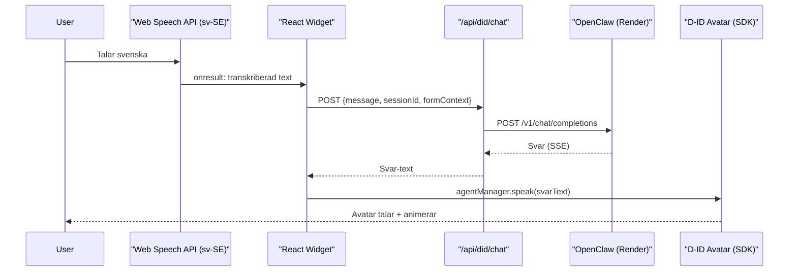

# Hybrid D-ID + OpenClaw Agent med fungerade roest

## Problem

D-IDs inbyggda STT transkriberar inte svenska korrekt med Custom LLM. Text-chat fungerar men roest goer det inte. Vi behover baade fungerande roest OCH OpenClaw-kunskap.

## Loesning: Client SDK + Web Speech API + speak()

Byt fran D-IDs embed-script (`agent.d-id.com/v2/index.js`) till deras Client SDK (`@d-id/client-sdk`). Hantera STT sjaelva med webblaesarens inbyggda Web Speech API (som stodjer `sv-SE`), och anvand `agentManager.speak()` for att mata avataren med OpenClaw-svar.




## Foerdelar vs nuvarande loesning

- **STT**: Web Speech API stodjer `sv-SE` nativt - kringgaar D-IDs trasiga STT
- **Hjaerna**: OpenClaw behaalls som LLM (flyttkunskap, formulaerkontext, verktygsanrop)
- **Avatar**: D-ID renderar video + TTS som vanligt via speak()
- **Text-chat**: Behaalls parallellt (skriver i widget -> samma endpoint -> OpenClaw)
- **D-ID-agent**: Kan seattas tillbaka till `provider: "openai"` (eller helt utan LLM) since vi aldrig anvander D-IDs LLM-pipeline laengre

## Nyckelfiler att aendra

### 1. Installera D-ID Client SDK

```bash
npm install @d-id/client-sdk
```

### 2. Ersaett embed-widget med SDK-widget

Skriv om [components/did-openclaw-bridge-widget.tsx](components/did-openclaw-bridge-widget.tsx):

- Ta bort `<Script src="https://agent.d-id.com/v2/index.js" .../>` embed-scriptet
- Importera `@d-id/client-sdk`
- Skapa `agentManager` med `createAgentManager()`
- Rendera ett `<video>` element for avataren
- Laegg till Web Speech API (`SpeechRecognition`) for svenska STT
- Nar STT ger text: skicka till `/api/did/chat` -> faa svar -> `agentManager.speak(svar)`
- Behall befintlig form-blur-tracking och form_sync-logik

### 3. Uppdatera `/api/did/chat` endpoint

[app/api/did/chat/route.ts](app/api/did/chat/route.ts) behoever:

- Fortsaetta hantera `field_blur` och `form_sync` (redan klart)
- For chat-meddelanden: skicka till OpenClaw, returnera svar som JSON (inte SSE, since widgeten laeser det direkt)
- Ingen foraendring i OpenClaw-logiken

### 4. D-ID agent config

Byt tillbaka agenten till `provider: "openai"` (eller ta bort LLM helt) since vi anvander `speak()` mode istallet for Custom LLM. D-ID behoever bara hantera TTS + avatar.

### 5. CSP-headers

[next.config.mjs](next.config.mjs) har redan raett CSP for D-ID domaner. Inga aendringar behoevs.

## Risker och begaensningar

- **Web Speech API**: Stods i Chrome, Edge, Safari. Firefox har begransat stod. Fallback: text-input.
- **speak() vs chat()**: `speak()` gor att avataren saeger texten men konversationshistoriken haanteras inte av D-ID. Vi haanterar historik sjaelva i session-store (redan implementerat).
- **Latens**: En extra round-trip (browser -> Vercel -> OpenClaw -> Vercel -> browser -> D-ID speak). Bor vara acceptabelt med SSE streaming.

