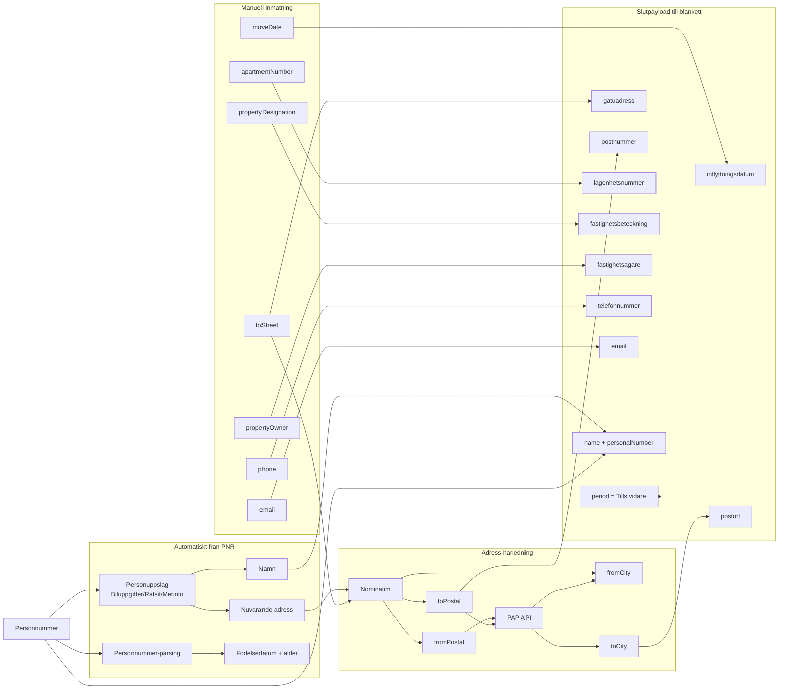

# Spindelnat: flyttanmalan v2 (PNR som startpunkt)

Detta schema visar hur all data till slutblanketten kan samlas in med
`personnummer` som minsta gemensamma namnare, samt vilka delar som fortfarande
maste goras manuellt.

## Spindelnat (oversikt)

## Krav per falt

| Slutfalt | Hur det fylls | Kravstatus |
|---|---|---|
| `inflyttningsdatum` | Manuellt (`moveDate`) | Krav |
| `period` | Forvalt `true` (Tills vidare) | Krav |
| `gatuadress` | Manuellt (`toStreet`) | Krav |
| `postnummer` | Manuellt eller harlett via Nominatim/PAP | Krav |
| `postort` | Manuellt eller harlett via PAP | Krav |
| `lagenhetsnummer` | Manuellt | Villkorat |
| `fastighetsbeteckning` | Manuellt (framtid: VALID/Lantmateriet) | Valfritt |
| `fastighetsagare` | Manuellt | Valfritt |
| `telefonnummer` | Manuellt | Valfritt |
| `email` | Manuellt | Valfritt |

## Viktig slutsats

`personnummer` ar en stark startpunkt for namn + delar av nuvarande adress, men
racker inte ensam for en komplett flyttanmalan. Ny adress och flyttdatum maste
normalt anges manuellt.

