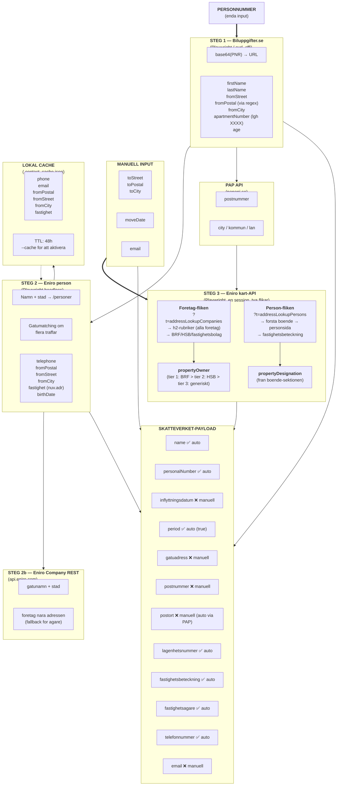
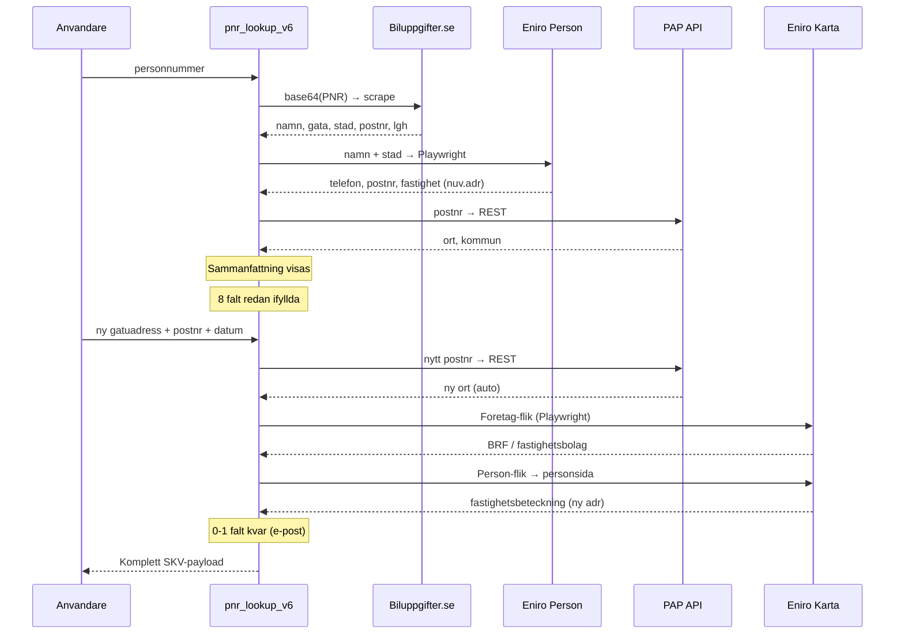

# Spindelnat: flyttanmalan v6 — PNR till komplett blankett

## Oversikt

v6 anvander personnumret som enda startpunkt och hamtar automatiskt
**12 av 14 falt** i Skatteverkets flyttblankett. Enbart **ny adress**,
**flyttdatum** och **e-post** kraver manuell inmatning.

---

## Flodesschema (Mermaid)

---

## Datakallor och varfor

| # | Kalla | Typ | Ger | Varfor denna? |
|---|-------|-----|-----|---------------|
| 1 | **Biluppgifter.se** | Playwright/curl_cffi scrape | namn, stad, gatuadress, postnr, lgh-nr | Enda oppna kallan som tar **fullt PNR** → namn+adress utan API-nyckel. Cloudflare-skyddad → kravs headless browser eller impersonate. |
| 2 | **Eniro person** | Playwright scrape (personsida) | telefon, postnr, gata, stad, fastighetsbeteckning (nuv.adr), fodelsedatum | JSON-LD (`@type: Person`) pa personsidan ar en ren datakalla. Fastighetsbeteckning finns i synlig HTML under "boende"-sektionen. |
| 2b | **Eniro Company REST** | REST API (`api.eniro.com`) | foretag nara adressen | Snabb fallback om kart-uppslaget misslyckas. Kraver API-nyckel. |
| 3a | **Eniro karta: Foretag-flik** | Playwright (`?t=addressLookupCompanies`) | alla foretag pa nya adressen | **BRF/HSB-namn** listas har som `<h2>`-rubriker. Battre an personsidan for att hitta faktisk fastighetsagare. |
| 3b | **Eniro karta: Person-flik** | Playwright (`?t=addressLookupPersons`) | boende → personsida → fastighetsbeteckning | Enda sattet att fa fastighetsbeteckning for **ny adress** utan Lantmateriet. Gar via en befintlig boendes personsida. |
| 4 | **PAP API** | REST (`papapi.se`) | ort, kommun, lan fran postnummer | Latt, snabb, ingen scraping. Fyller i `toCity` automatiskt nar anvandaren angett postnr. |
| — | **Lokal cache** | JSON-fil | phone, email, fromPostal, fromStreet, fromCity, fastighet | Sparar ~20 sek vid omkorning. Aktiveras med `--cache`, TTL 48h. |

---

## Faltmatris: vad ar auto vs manuellt

| SKV-falt | Auto? | Kalla | Kommentar |
|----------|-------|-------|-----------|
| `name` | ✅ | Biluppgifter | Alltid tillgangligt |
| `personalNumber` | ✅ | Input | Anvandaren anger det |
| `inflyttningsdatum` | ❌ | Manuell | Kan aldrig gasas |
| `period` | ✅ | Default | Forvalt "Tills vidare" |
| `gatuadress` (ny) | ❌ | Manuell | Anvandaren maste ange ny adress |
| `postnummer` (ny) | ❌ | Manuell | Anvandaren anger, PAP validerar |
| `postort` (ny) | ⚡ | PAP API | Auto om postnr anges forst |
| `lagenhetsnummer` | ✅ | Biluppgifter | Extraheras fran `lgh XXXX` i radress |
| `fastighetsbeteckning` | ✅ | Eniro karta (person-flik) | Via boende pa nya adressen |
| `fastighetsagare` | ✅ | Eniro karta (foretag-flik) | BRF/HSB prioriteras med tier-system |
| `telefonnummer` | ✅ | Eniro person | Fran nuvarande adress-uppslag |
| `email` | ❌ | Manuell | Finns inte i nagon oppen kalla |

**Resultat: 8 av 12 slutfalt ar helt automatiska, 1 (postort) ar semi-auto, 3 kraver manuell input.**

---

## Vad vi sparar extra (cache)

Cachen (`--cache`) lagrar 6 falt per PNR mellan korningar:

| Falt | Typ | Sparas nar |
|------|-----|------------|
| `phone` | Telefon | Efter Eniro person-uppslag |
| `email` | E-post | Efter manuell input |
| `fromPostal` | Postnr (nuv) | Efter Biluppgifter + Eniro |
| `fromStreet` | Gata (nuv) | Efter Biluppgifter + Eniro |
| `fromCity` | Ort (nuv) | Efter Biluppgifter + Eniro + PAP |
| `fastighet` | Fast.bet (nuv) | Efter Eniro person |

### Kan vi spara mer?

| Falt | Mojligt? | Varfor/varfor inte |
|------|----------|-------------------|
| `firstName`, `lastName` | Ja, men Biluppgifter ar snabb | Lite vinst, ~3 sek |
| `apartmentNumber` | Ja | Kan laggas till i cache |
| `age`, `birthDate` | Ja | Anvandbart for AI-agenten |
| `propertyDesignation` (ny adr) | Nej — beror pa vilken ny adress man anger | Ny varje gang |
| `propertyOwner` (ny adr) | Nej — samma skal | Ny varje gang |

---

## Varfor denna vag ar den basta

### Inga alternativ utan kostnader

| Alternativ | Problem |
|-----------|---------|
| **SPAR** (Statens personadressregister) | Kraver juridisk avtalsteckning + organisationsnummer. Inte tillgangligt for privatperson/startup. |
| **Lantmateriet / VALID API** | Fastighetsbeteckning direkt fran kartan, men kraver licens + avgift per uppslag. |
| **Ratsit/Merinfo API** | Erbjuder API-paket men kostar 500-5000 kr/man for begransad volym. |
| **allabrf.se** | Kraver inloggning, ingen oppen API. HAR-filer kravs for reverse-engineering. |
| **Docker-scrapers pa Render** | Inte langre ett alternativ (enligt dig). |

### Vad v6 gor ratt

1. **Noll kostnad** — alla kallor ar oppna eller gratis (Eniro, Biluppgifter, PAP).
2. **En enda input** — personnumret racker. Allt annat harledas.
3. **Smart kedja** — varje steg bygger pa foregaende:
   `PNR → namn → personsida → telefon + fastighet → ny adress → kartvy → BRF + beteckning`
4. **Tier-system for agare** — BRF hittas forst, generiska fastighetsbolag ar sista utvag.
5. **Foretag-fliken** — den stora vinsten i v6. Personsidans "foretag pa adressen" ar otillforlitlig (listar alla foretag pa adressen), men Foretag-flikens h2-rubriker ar exakt samma lista som Eniros kartvy visar — och kan filtreras med nyckelord.
6. **Minimal manuell input** — bara 3 falt maste alltid skrivas in: ny gatuadress, postnr och flyttdatum. E-post kan inte hamtas automatiskt fran nagon oppen kalla.

---

## Sekvensdiagram (tidsordning)

