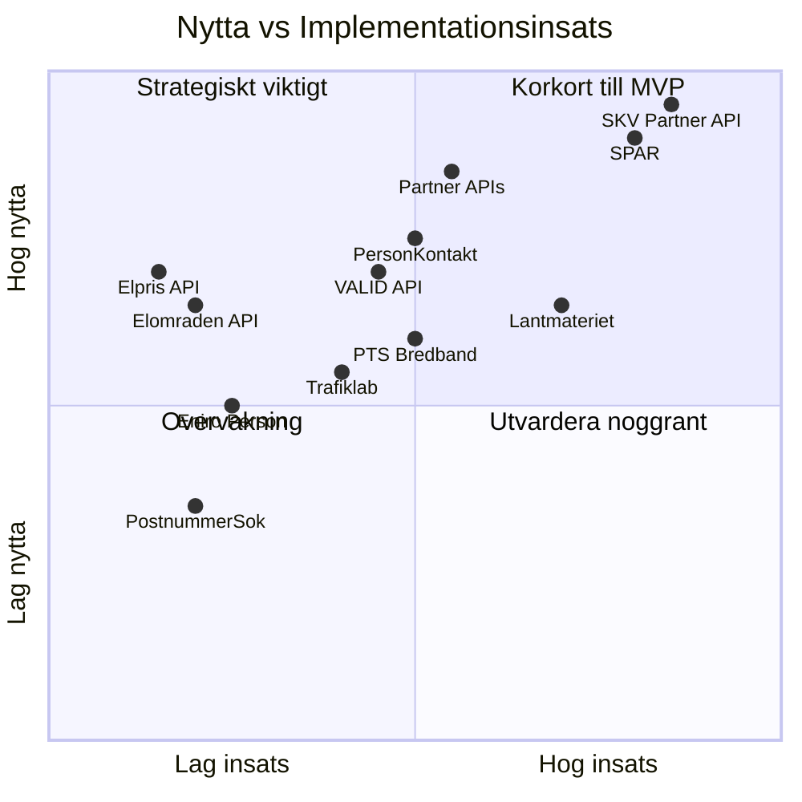

# API-roadmap for Flytt.io

Senast uppdaterad: 2026-02-25

## Fas 1: NU (aktiva — redan integrerade)

| API | Anvandningsfall | Faltnytta | Juridisk risk | Kostnad | Fil |
|---|---|---|---|---|---|
| PAP API | Postnummer -> ort, kommun, lan, GPS | `postort` autofyll (98-99%) | Ingen | Gratis (1 post/anrop) | `lib/aida/enrich.ts` |
| Nominatim (OpenStreetMap) | Adress -> validerad position, stadsdel, kommun | Adressrimlighet, GPS | Ingen (oppen data) | Gratis (max 1 req/s) | `lib/aida/enrich.ts` |
| Eniro Company Search | Ort -> foretag (matbutiker, vardcentral, apotek) | Lokala rekommendationer | Ingen (trial aktiv) | Gratis (trial) | `lib/aida/enrich.ts` |
| SCB API v2 (TAB638) | Kommunkod -> befolkning, folkokning | Kontextuell info for Aida | Ingen (oppen data) | Gratis | `lib/aida/enrich.ts` |
| OpenClaw Gateway | Chat completions med formularkontext | AI-resonemang, suggestion-block | Ingen (egen deployment) | Render-kostnad | `app/api/did/chat/route.ts` |
| D-ID Client SDK | Avatar + TTS (sv-SE-SofieNeural) | Rostinteraktion | Lag (DPA rekommenderas) | D-ID-plan | `components/did-openclaw-bridge-widget.tsx` |
| Resend / SendGrid | Paminnelsemail for checklistmoment | Transaktionell e-post | Lag (DPA kravs) | Freemium | `app/api/cron/reminders/route.ts` |

## Fas 2: NASTA (lagt hangande frukter — inte integrerade annu)

| API | Anvandningsfall | Faltnytta | Juridisk risk | Kostnad | Implementationsinsats |
|---|---|---|---|---|---|
| **Elpriset just nu** (elprisetjustnu.se/elpris-api) | Visa aktuellt elpris per elomrade (SE1-SE4) | Trigger for elavtalsjamforelse | Ingen (oppen data) | Gratis | Lag — statisk JSON, 1 fetch |
| **Elomraden.se API** (elomraden.se/api) | Postnummer -> elomrade + natbolag | Koppla postnr till elomrade | Lag | Gratis (kontakta for kommersiellt bruk) | Lag — postnummer-input redan tillgangligt |
| **Trafiklab** (trafiklab.se/api) | Koordinater -> narmaste hallplats, pendlingstid | Pendlingsinfo for ny stad | Ingen (oppen data, API-nyckel kravs) | Gratis | Medel — registrera nyckel, GTFS/ResRobot-integration |
| **PostNord / PostnummerSok** (postnummersok.se) | Avancerat postnummeruppslag, avstand mellan postnr | Flytt-avstand, postcoverage | Ingen | Gratis / betalplan | Lag — REST API, kompletterar PAP |
| **PTS Bredbandskartan** (bredbandskartan.pts.se) | Adress/omrade -> bredbandstillgang (fiber/coax/mobil) | Underlag for bredbandsjamforelse | Ingen (oppen data) | Gratis | Medel — scraping/dataset, inget officiellt API |
| **Eniro Person Search** (betald plan) | Namn + ort -> personlista, telefon -> person | Personidentifiering (80-90%) | Medel (DPA kravs, GDPR) | 990 kr/man | Lag — redan integrerad foretags-sok, utoka |

## Fas 3: SENARE (hogre ambition — kraver avtal eller tillstand)

| API | Anvandningsfall | Faltnytta | Juridisk risk | Kostnad | Implementationsinsats |
|---|---|---|---|---|---|
| **VALID API** (Geposit) | Adress -> fastighetsbeteckning, autocomplete | `fastighetsbeteckning` autofyll | Lag | Betalplan | Medel — REST, bra dokumentation |
| **Lantmateriet** | Adress -> fastighetsbeteckning | Auktoritativ kalla for fastighetsdata | Lag | Gratis (tillstand kravs) | Hog — OAuth2, juridisk ansokan |
| **SPAR** (Statens personadressregister) | Personnummer -> namn, adress, folkbokforing | Full personverifiering (97%+) | Medel-hog (tillstand + GDPR) | Ansokningskostnad | Hog — SOAP/XML, klientcertifikat |
| **PersonKontakt / Marknadsinformation** | Telefon/personnr -> person + adress (SPAR-data) | Personidentifiering (85-95%) | Medel (DPA + andamal) | Avtal | Medel — REST, kontakta for offert |
| **Signicat / UC / ZignSec** | Aggregerad SPAR + kreditdata | Identitetsverifiering, komplettering | Medel (DPA + avtal) | Betalplan | Medel — REST/SDK |
| **Skatteverkets API** (partner-API) | Flyttanmalan direkt via API | Eliminerar Playwright-beroende | Lag (officiell integration) | Gratis (tillstand) | Hog — ansokan, juridisk granskning |
| **Partner-API:er** (el, forsakring, bredband) | Lead-generering, prishamtning per erbjudande | Affarsnytta: monetisering per vertikal | Lag (avtal per partner) | Rev share | Medel — per partner |

## Prioriteringsmatris

## Rekommenderad ordning

### Vecka 1-2 (Fas 2, lag insats)
1. **Elpriset just nu API** — enklast av alla, hog synlig nytta for anvandaren.
2. **Elomraden.se API** — koppling postnummer -> elomrade, driver elavtalsjamforelse.
3. **PostnummerSok** — utoka PAP med avstand/koordinater for flytt-upplevelse.

### Vecka 3-4 (Fas 2, medel insats)
4. **Trafiklab ResRobot** — "din nya pendling" i checklistvy/Aida.
5. **PTS Bredbandskartan** — "bredband pa din nya adress" i jamforelseflode.
6. **Eniro Person** (uppgradering) — om ni vill ha personidentifiering for pre-fill.

### Manad 2+ (Fas 3, strategiskt)
7. **VALID API** — fastighetsbeteckning autofyll (hog nytta for SVK-form).
8. **PersonKontakt** — avtal + DPA, starkt personuppgiftsstod.
9. **Partner-API:er** — el, forsakring, bredband: affarsmodellens karna.
10. **SPAR** — full compliance, auktoritativ data, lang ansokningstid.

## Relaterade filer

- Aktiva API-anrop: `lib/aida/enrich.ts`
- Postaluppslag: `app/api/enrich/postal/route.ts`
- Samlad API-analys: `info/flytta_nu_samlad_kunskap.txt` (DEL 3)
- GDPR-aspekter: `info/GDPR-HANDLINGSGUIDE-FLYTTIO.md`
- Faltlogik: `info/MINDMAP-API-LOGIK-FLYTTBLANKETT.md`
