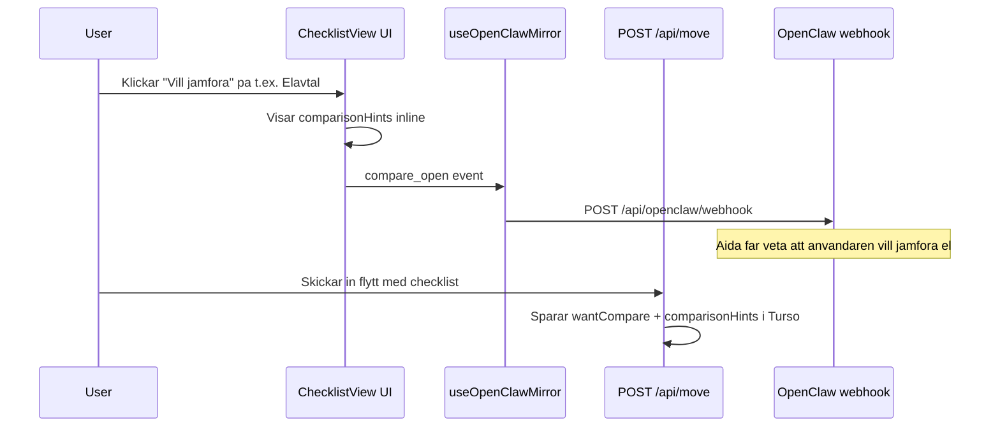

# Flyttplanerare / jamforelsedel — kartlaggning

Senast uppdaterad: 2026-02-25

## 1. Oversikt

Flytt.io har idag en **datumdriven flyttchecklista** med 23 moment fordelade pa
7 sektioner. Varje moment har en `dayOffset` relativt inflyttningsdatum, kolumnerna
"Behover hjalp" och "Vill jamfora", och valfria `comparisonHints` som visar
specifika jamforelseaspekter nar anvandaren klickar i "Vill jamfora".

Nedan dokumenteras var varje del av denna logik lever i kodbasen.

## 2. Filer och ansvar

| Fil | Roll |
|---|---|
| `lib/checklist/template.ts` | Karnlogik: 23 moment med `dayOffset`, `category`, `comparisonHints` |
| `app/api/checklist/template/route.ts` | API-route: tar emot `moveDate` + `toCity`, returnerar datumklar checklista |
| `app/adressandring/page.tsx` (steg 4) | Frontend: laddar checklista, hanterar `needHelp`/`wantCompare`-toggling |
| `components/checklist-view.tsx` | UI-komponent: renderar checklista med progress, sektioner, jamforelsehints |
| `app/api/move/route.ts` | Persistering: sparar checklista med `wantCompare` + `comparisonHints` till Turso |
| `lib/db/schema.ts` | Databasschema: `checklistItems`-tabell med `comparison_hints` (JSON) |
| `lib/db/migrate.ts` | Migrering: skapar `comparison_hints`-kolumn |
| `app/dashboard/page.tsx` | Dashboard: lasevy av sparad checklista |
| `hooks/use-openclaw-mirror.ts` | Event-spegling: skickar `compare_open`/`compare_close` till OpenClaw webhook |
| `lib/aida/enrich.ts` | Proaktiv jamforelse: `getComparisonOpportunities()` injiceras i Aidas kontext |
| `app/api/cron/reminders/route.ts` | Paminnelser: skickar mail for moment med `dueDate` inom lookahead-perioden |

## 3. De 23 momenten — sektioner och veckologik

Alla `dayOffset`-varden ar relativa till inflyttningsdatum (negativa = fore, positiva = efter).

### Sektion 1: Adress, post, myndigheter
| # | taskKey | Titel | dayOffset | Jamforelsehints |
|---|---|---|---|---|
| 1 | `address_skv` | Folkbokforing/adressandring (SKV) | -14 | — |
| 2 | `mail_forwarding` | Eftersandning post | -14 | Langd, pris, vad som ingar |
| 3 | `authority_updates` | Adress hos myndigheter/tjanster | -7 | — |

### Sektion 2: Boende och avtal
| # | taskKey | Titel | dayOffset | Jamforelsehints |
|---|---|---|---|---|
| 4 | `housing_notice` | Uppsagning hyresavtal / forsaljning BRF | -45 | — |
| 5 | `inspection_keys` | Besiktning/overlamning/nycklar | -7 | — |
| 6 | `cleaning_service` | Flyttstadning | -14 | Stadfirma pris, garanti, vad som ingar |
| 7 | `storage_gap` | Magasinering (glapp mellan datum) | -21 | m3, klimatkontroll, forsakring |

### Sektion 3: El, varme och hemforsakring
| # | taskKey | Titel | dayOffset | Jamforelsehints |
|---|---|---|---|---|
| 8 | `electricity_contract` | Elavtal | -28 | Rorligt/fast, paslag, bindningstid |
| 9 | `home_insurance` | Hemforsakring | -21 | Bostadstyp, sjalvrisk, drulle/skydd |
| 10 | `water_heating_gas` | Vatten/fjarrvarme/gas | -21 | — |

### Sektion 4: Bank och ekonomi
| # | taskKey | Titel | dayOffset | Jamforelsehints |
|---|---|---|---|---|
| 11 | `bank_address` | Ny adress hos banken | -7 | — |
| 12 | `autogiro_bills` | Autogiron/fakturor kopplat till adress | -7 | — |

### Sektion 5: Bredband och teknik
| # | taskKey | Titel | dayOffset | Jamforelsehints |
|---|---|---|---|---|
| 13 | `broadband_tech_check` | Kontrollera teknik pa nya adressen | -35 | Leverantorer, installationstid, Wi-Fi 6 |
| 14 | `broadband_cancel_or_move` | Uppsagning/flytt av nuvarande tjanst | -28 | — |
| 15 | `broadband_order_install` | Bestalla nytt bredband + installation | -28 | Pris efter kampanj, bindningstid, routerkostnad |
| 16 | `wifi_plan` | Router/Wi-Fi-plan | -3 | — |
| 17 | `speed_coverage_test` | Hastighets-/tackningstest | +2 | — |

### Sektion 6: Flyttlogistik
| # | taskKey | Titel | dayOffset | Jamforelsehints |
|---|---|---|---|---|
| 18 | `movers_or_trailer` | Flyttfirma eller hyra slap | -30 | Timpris/fast pris, forsakring, omdomen |
| 19 | `packing_material` | Packmaterial | -21 | — |
| 20 | `parking_permit` | Parkeringstillstand/lastzon | -7 | — |

### Sektion 7: Efter inflytt
| # | taskKey | Titel | dayOffset | Jamforelsehints |
|---|---|---|---|---|
| 21 | `safety_checks` | Sakerhet: brandvarnare, las, nycklar | +1 | — |
| 22 | `subscriptions_update` | Adress hos abonnemang | +7 | — |
| 23 | `final_reconciliation` | Slutavstamning: post, avtal | +14 | — |

## 4. Tidslinje / veckovy

```
Vecka -6 till -5 (dayOffset -45 till -35):
  housing_notice (-45)      Uppsagning hyresavtal
  broadband_tech_check (-35) Kontrollera teknik

Vecka -4 (dayOffset -28 till -30):
  electricity_contract (-28) Elavtal
  broadband_cancel_or_move (-28) Uppsagning nuvarande
  broadband_order_install (-28) Bestalla nytt bredband
  movers_or_trailer (-30)   Flyttfirma / slap

Vecka -3 (dayOffset -21):
  home_insurance (-21)      Hemforsakring
  water_heating_gas (-21)   Vatten/fjarrvarme
  storage_gap (-21)         Magasinering
  packing_material (-21)    Packmaterial

Vecka -2 (dayOffset -14):
  address_skv (-14)         Flyttanmalan
  mail_forwarding (-14)     Eftersandning post
  cleaning_service (-14)    Flyttstadning

Vecka -1 (dayOffset -7 till -3):
  authority_updates (-7)    Myndigheter
  inspection_keys (-7)      Besiktning/nycklar
  bank_address (-7)         Bank adress
  autogiro_bills (-7)       Autogiron
  parking_permit (-7)       Parkeringstillstand
  wifi_plan (-3)            Router/Wi-Fi

Flyttdagen (dayOffset 0)

Vecka +1 (dayOffset +1 till +7):
  safety_checks (+1)        Sakerhet
  speed_coverage_test (+2)  Bredbandtest
  subscriptions_update (+7) Abonnemangsadress

Vecka +2 (dayOffset +14):
  final_reconciliation (+14) Slutavstamning
```

## 5. Jamforelseflodet — hur det fungerar idag



### Idag: jamforelseinformation visas som text-hints
Nar anvandaren klickar "Vill jamfora" pa ett moment visas `comparisonHints` direkt i raden, t.ex.:

> **Jamforelse:** Rorligt eller fast / Paslag / Bindningstid

Det finns **annu ingen aktiv jamforelsemotor** som hamtar priser/leverantorer. Jamforelsehints
ar statiska texter som ger anvandaren en tankeriktning.

### Proaktiv jamforelse via Aida (nyligen tillagt)
`lib/aida/enrich.ts` innehaller `getComparisonOpportunities()` som injicerar
jämförelseinsikter i Aidas kontext baserat pa `toCity` + `moveDate`:
- Bredband, el, hemforsakring trigger nar ny adress ar ifylld.
- Tidspress-trigger nar flyttdatum ar nara.

## 6. Moment som saknas (jamfort med samlad kunskap)

I `info/flytta_nu_samlad_kunskap.txt` och Fortum-checklistan namns ytterligare moment
som inte finns i nuvarande template:

| Saknat moment | Forvantad sektion | dayOffset (uppskattning) | Jamforelseaspekt |
|---|---|---|---|
| Hemlarm | El/varme/forsakring | -21 | Priser, sjavsinstallation vs. monterad |
| Matkasse / leverans | Efter inflytt | +3 | Pris, flexibilitet, omrade |
| Sellpy / second hand | Boende och avtal | -30 | — |
| Barnflytt (forskola/skola) | Administration | -30 | Koplatser, avstand |
| Fastighetslån / bank-byte | Bank och ekonomi | -28 | Ranta, villkor |
| Lasmontage/nyckelservice | Sakerhet | -3 | Pris, tillganglighet |
| Grovsopor / avc | Logistik | -7 | Kommunspecifik (tid/plats) |

## 7. Vart jamforelsefloden bor ga (rekommendation)

### Fas 1: Utoka comparisonHints med API-data
- Nar `wantCompare` ar true och `taskKey` ar `electricity_contract`:
  hamta elpris/elomrade via Elpriset just nu + Elomraden.se.
- Nar `wantCompare` ar true och `taskKey` ar `broadband_order_install`:
  hamta bredbandstillgang via PTS-data (nar tillgangligt).

### Fas 2: Comparison orchestrator API
- Ny route: `/api/compare/[taskKey]`
- Tar emot `toPostal`, `toCity`, `moveDate`, `taskKey`.
- Returnerar konkreta leverantorer/priser baserat pa partner-API:er.

### Fas 3: In-line jamforelsekort i checklistan
- Byt ut text-hints mot interaktiva kort med faktiska erbjudanden.
- "Vill jamfora" okar ett kort med leverantorer, priser, och "Valj"-knapp.
- Opt-in: "Jag vill bli kontaktad om detta erbjudande" -> lead till partner.

## Relaterade filer

- Checklistmall: `lib/checklist/template.ts`
- Checklist-API: `app/api/checklist/template/route.ts`
- Checklist-UI: `components/checklist-view.tsx`
- Formularsteg 4: `app/adressandring/page.tsx`
- Persistering: `app/api/move/route.ts`
- DB-schema: `lib/db/schema.ts`
- Paminnelser: `app/api/cron/reminders/route.ts`
- Event-mirror: `hooks/use-openclaw-mirror.ts`
- Proaktiv jamforelse: `lib/aida/enrich.ts` (`getComparisonOpportunities`)
- Samlad kunskap: `info/flytta_nu_samlad_kunskap.txt`
- GDPR for jamforelsedata: `info/GDPR-HANDLINGSGUIDE-FLYTTIO.md`
- API-roadmap: `info/API-ROADMAP-FLYTTIO.md`
- Faltlogik: `info/MINDMAP-API-LOGIK-FLYTTBLANKETT.md`
