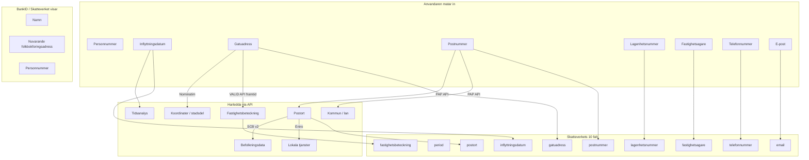
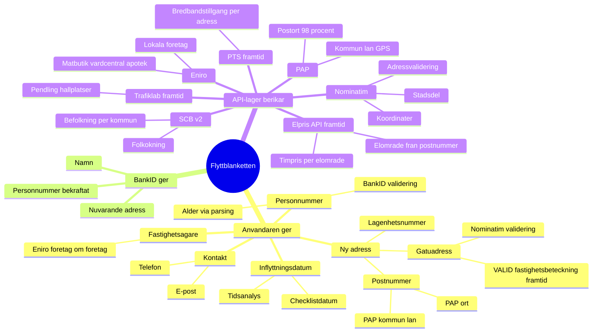
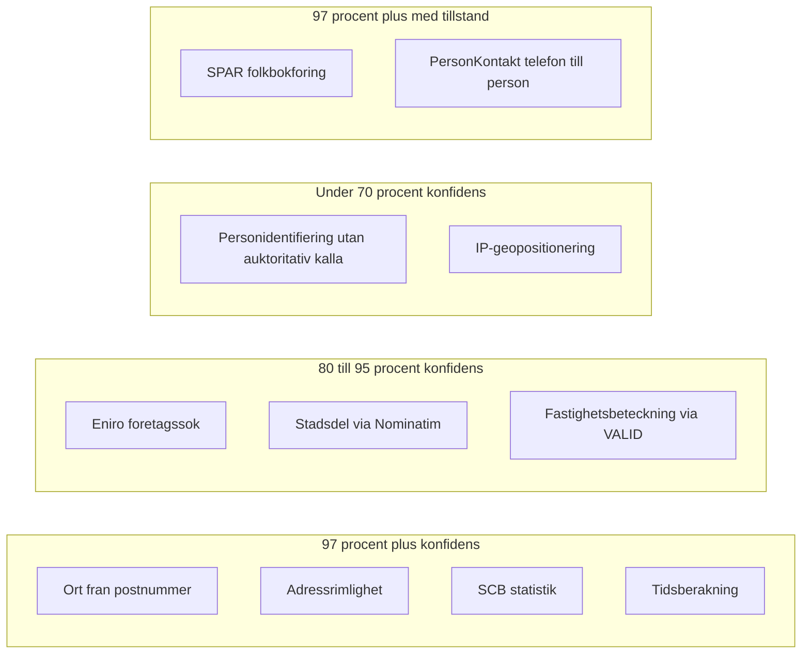

# Mindmap: API-logik och faltharledning for Skatteverkets flyttblankett

Senast uppdaterad: 2026-02-25

## 1. Oversikt — fran anvandare till Skatteverket



## 2. Minsta gemensamma namnare — vad anvandaren MASTE ge

Oavsett vilka API:er som finns maste anvandaren sjalv uppge:

| Uppgift | Varfor den inte kan harledas | Skatteverksfalt |
|---|---|---|
| Inflyttningsdatum | Personlig beslutsinformation | `inflyttningsdatum` |
| Gatuadress (ny) | Specifik bostadsadress | `gatuadress` |
| Postnummer (ny) | Ingen saker omvand harledning fran ort/gata | `postnummer` |
| Lagenhetsnummer | Specifikt per dorr, inte tillgangligt i oppen data | `lagenhetsnummer` |
| Fastighetsagare | Kan vara privatperson, BRF eller foretag | `fastighetsagare` |
| Telefonnummer | Kontaktuppgift | `telefonnummer` |
| E-post | Kontaktuppgift | `email` |

**Total: 7 uppgifter fran anvandaren.**

## 3. Vad som kan harledas automatiskt

| Harlett falt | Kalla | Indata | Konfidens | Status |
|---|---|---|---|---|
| Postort | PAP API | postnummer (5 siffror) | 98-99% | AKTIV |
| Kommun, lan | PAP API | postnummer | 95-98% | AKTIV |
| GPS-koordinater | Nominatim | gata + ort + postnummer | 97-99% | AKTIV |
| Stadsdel | Nominatim | gata + ort | 85-95% | AKTIV |
| Befolkningsdata | SCB v2 | kommunkod | 99% (statistik) | AKTIV |
| Lokala tjanster | Eniro Company | ort + sokterm | 90-95% (relevans) | AKTIV |
| Fastighetsbeteckning | VALID API / Lantmateriet | gata + postnummer + ort | 95%+ | FRAMTID |
| Tidsanalys (dagar kvar, prio) | Lokal berakning | inflyttningsdatum | 100% | AKTIV |

## 4. Faltrelationer — mermaid mindmap



## 5. Konfidensniva per datalager



## 6. Faltmatris — Skatteverkets falt vs datakallor

| SKV-falt | Kravs | Primar kalla | Sekundar kalla | Konfidens |
|---|---|---|---|---|
| `inflyttningsdatum` | Ja | Anvandaren | — | 100% (manuell) |
| `period` | Ja | Forvalt "Tills vidare" | — | 100% |
| `gatuadress` | Ja | Anvandaren | Nominatim autocomplete | 100% (manuell) |
| `postnummer` | Ja | Anvandaren | — | 100% (manuell) |
| `postort` | Ja | PAP API | Fallback-tabell | 98-99% |
| `lagenhetsnummer` | Nej* | Anvandaren | Hyreskontrakt | 100% (manuell) |
| `fastighetsbeteckning` | Nej | Anvandaren | VALID API (framtid) | 95%+ (API) |
| `fastighetsagare` | Nej | Anvandaren | Eniro Company | 80-90% (om foretag) |
| `telefonnummer` | Nej | Anvandaren | — | 100% (manuell) |
| `email` | Nej | Anvandaren | — | 100% (manuell) |

*Kravs om fastigheten har lagenhetsnummer.

## 7. Harledningskedja for maximal autofyll

```
Anvandaren skriver: postnummer + gatuadress
  -> PAP API:      postnummer -> postort, kommun, lan  (AKTIV)
  -> Nominatim:    gata + ort -> validerad adress, koordinater, stadsdel  (AKTIV)
  -> VALID API:    gata + postnr + ort -> fastighetsbeteckning  (FRAMTID)
  -> Eniro:        ort -> lokala matbutiker, vardcentral, apotek  (AKTIV)
  -> SCB v2:       kommunkod -> befolkning, folkokning  (AKTIV)
  -> Elpris API:   postnummer -> elomrade -> timpris  (FRAMTID)
  -> Trafiklab:    koordinater -> narmaste hallplats, pendlingstid  (FRAMTID)
  -> PTS:          adress/omrade -> bredbandstillgang  (FRAMTID)

Resultat: 3 av 10 SKV-falt auto-ifyllda, 5+ extra kontextfalt for Aida.
Med VALID API: 4 av 10 SKV-falt.
```

## Relaterade filer

- Enrichment-logik: `lib/aida/enrich.ts`
- Autofill fallback: `lib/aida/direct-suggestion.ts`
- Faltkunskap i systemprompt: `lib/aida/enrich.ts` (`FIELD_KNOWLEDGE` export)
- Postaluppslag: `app/api/enrich/postal/route.ts`
- Samlad kunskap (DEL 2 + 3): `info/flytta_nu_samlad_kunskap.txt`
