# Mindmap: API-logik och faltharledning for Skatteverkets flyttblankett

Senast uppdaterad: 2026-02-27

## 1. Oversikt — fran anvandare till Skatteverket

```mermaid
flowchart TD
  subgraph userProvided [Anvandaren matar in]
    pnr[Personnummer]
    moveDate[Inflyttningsdatum]
    street[Gatuadress]
    postal[Postnummer]
    aptNr[Lagenhetsnummer]
    propOwner[Fastighetsagare]
    phone[Telefonnummer]
    email[E-post]
  end

  subgraph autoFromBankID [BankID / Skatteverket visar]
    curName[Namn]
    curAddress[Nuvarande folkbokforingsadress]
    curPnr[Personnummer bekraftat]
  end

  subgraph apiDerived [Harledda via API — AKTIVA idag]
    city[Postort — PAP]
    geoData[Koordinater / stadsdel — Nominatim]
    munData[Kommun / lan — PAP]
    popData[Befolkningsdata — SCB]
    localServices[Lokala tjanster — Eniro]
    moveDateInsights[Tidsanalys — lokal]
    elArea[Elnatsomrade SE1-SE4 — lokal]
    compareData[Jamforelsedata el/bredband/forsakring — gpt-4.1 web search]
    personAge[Fodelsedatum + alder — lokal parsing]
    autoPostal[Auto-uppslaget postnummer — Nominatim]
  end

  subgraph future [Framtida API-harledning]
    propDesig[Fastighetsbeteckning — VALID API]
    sparData[Namn + folkbokforingsadress — SPAR]
    elPrice[Elpris per timme — Elpriset just nu]
    transit[Pendling hallplatser — Trafiklab]
    broadband[Bredbandstillgang — PTS]
  end

  subgraph skvForm [Skatteverkets 10 falt]
    skvDate[inflyttningsdatum]
    skvPeriod[period]
    skvStreet[gatuadress]
    skvPostal[postnummer]
    skvCity[postort]
    skvApt[lagenhetsnummer]
    skvPropDesig[fastighetsbeteckning]
    skvPropOwner[fastighetsagare]
    skvPhone[telefonnummer]
    skvEmail[email]
  end

  pnr -->|lokal parsing| personAge
  postal -->|PAP API| city
  postal -->|PAP API| munData
  postal -->|lokal mappning| elArea
  street -->|Nominatim| geoData
  street -->|Nominatim, om postal saknas| autoPostal
  city -->|SCB v2| popData
  city -->|Eniro| localServices
  city -->|gpt-4.1 web_search| compareData
  moveDate --> moveDateInsights

  street -->|VALID API framtid| propDesig
  pnr -->|SPAR framtid| sparData
  elArea -->|Elpris API framtid| elPrice
  geoData -->|Trafiklab framtid| transit
  street -->|PTS framtid| broadband

  moveDate --> skvDate
  street --> skvStreet
  postal --> skvPostal
  city --> skvCity
  aptNr --> skvApt
  propDesig --> skvPropDesig
  propOwner --> skvPropOwner
  phone --> skvPhone
  email --> skvEmail
```



## 2. Beroendegrafen — "om vi har X kan vi harleda Y"

Det har ar det fullstandiga pusslet for vilka falt som kan harledas fran vilka:

```
personnummer ──→ fodelsedatum + alder (lokal parsing, AKTIV)
                 ✗ namn (kraver SPAR/Navet)
                 ✗ adress (kraver SPAR/Navet)

fromPostal ────→ fromCity + kommun + lan (PAP API, AKTIV)
toPostal ──────→ toCity + kommun + lan (PAP API, AKTIV)
toPostal ──────→ elnatsomrade SE1-SE4 (lokal mappning, AKTIV)

fromStreet + fromCity ──→ fromPostal + koordinater (Nominatim, AKTIV)
toStreet + toCity ─────→ toPostal + koordinater (Nominatim, AKTIV)

toCity ────→ matbutiker, vardcentraler, apotek (Eniro, AKTIV)
toCity ────→ befolkning + tillvaxt (SCB v2, AKTIV)
toCity + toPostal ──→ jamforelsedata for el/bredband/forsakring/flytt/stad
                      (gpt-4.1 web_search via Responses API, AKTIV)

moveDate ──→ tidsanalys, prioriteringar, checklistdatum (lokal, AKTIV)

toStreet + toPostal + toCity ──→ fastighetsbeteckning (VALID API, FRAMTID)
personnummer ──→ namn + folkbokforingsadress (SPAR, FRAMTID)
toPostal + elnatsomrade ──→ elpris per timme (Elpriset just nu, FRAMTID)
koordinater ──→ narmaste hallplats, pendlingstid (Trafiklab, FRAMTID)
adress ──→ bredbandstillgang fiber/coax/mobil (PTS, FRAMTID)
```

## 3. Minsta gemensamma namnare — vad anvandaren MASTE ange

| Uppgift | Varfor den inte kan harledas | SKV-falt | Steg |
|---|---|---|---|
| Fornamn + efternamn | Kraver SPAR (personnr -> namn) | — | 1 |
| Personnummer | Identifieringsingång | — | 1 |
| E-post | Kontaktuppgift | `email` | 1 |
| Telefonnummer | Kontaktuppgift | `telefonnummer` | 1 |
| Nuvarande gatuadress | Kraver SPAR (personnr -> folkbokforing) | — | 2 |
| Nuvarande postnr ELLER ort | Ena racker — andra harlds via PAP/Nominatim | — | 2 |
| Ny gatuadress | Anvandarens val | `gatuadress` | 2 |
| Nytt postnr ELLER ny ort | Ena racker — andra harlds via PAP/Nominatim | `postnummer`/`postort` | 2 |
| Inflyttningsdatum | Personligt beslut | `inflyttningsdatum` | 3 |
| Lagenhetsnummer | Specifikt per dorr | `lagenhetsnummer` | 2 |
| Fastighetsagare | Privatperson/BRF/foretag | `fastighetsagare` | 2 |

**Total: ~11 uppgifter fran anvandaren.**
**Med SPAR: ~7 uppgifter** (namn + nuvarande adress forsvinner).

## 4. Vad som harlds automatiskt idag

| Harlett falt | Kalla | Indata | Konfidens | Status |
|---|---|---|---|---|
| Postort (fran/till) | PAP API | postnummer (5 siffror) | 98-99% | AKTIV |
| Kommun, lan | PAP API | postnummer | 95-98% | AKTIV |
| GPS-koordinater | Nominatim | gata + ort + postnummer | 97-99% | AKTIV |
| Stadsdel | Nominatim | gata + ort | 85-95% | AKTIV |
| Postnummer (om saknas) | Nominatim | gata + ort | 90-95% | AKTIV |
| Befolkningsdata | SCB v2 | kommunkod | 99% (statistik) | AKTIV |
| Lokala tjanster | Eniro Company | ort + sokterm | 90-95% (relevans) | AKTIV |
| Fodelsedatum + alder | Lokal parsing | personnummer | 100% | AKTIV |
| Elnatsomrade SE1-SE4 | Lokal mappning | postnummer | 100% | AKTIV |
| Tidsanalys (dagar kvar) | Lokal berakning | inflyttningsdatum | 100% | AKTIV |
| Jamforelsedata (5 kategorier) | gpt-4.1 web_search | ort + postnummer + datum | 85-95% | AKTIV |
| Saknade falt-lista | Lokal analys | alla falt | 100% | AKTIV |
| Fastighetsbeteckning | VALID API / Lantmateriet | gata + postnummer + ort | 95%+ | FRAMTID |

## 5. Stegordning och varfor

```
Steg 1: VEM — namn, personnummer, e-post, telefon
  → Triggar: AI-validering, personnummer-parsing (alder)
  → Inget kan harledas fran dessa falt till andra steg

Steg 2: VARIFRÁN + VART — adresser
  → Triggar HELA API-kaskaden:
    postnr → ort (PAP)
    gata+ort → postnr om saknas (Nominatim)
    gata+ort → koordinater (Nominatim)
    postnr → elnatsomrade (lokal)
    ort → foretagssok (Eniro)
    ort → befolkning (SCB)
  → Nar steg 2 ar klart har systemet all data for jamforelser

Steg 3: NÄR + VARFOR — datum, hushallstyp, anledning
  → moveDate triggar checklistgenerering (POST /api/checklist/template)
  → Tidsanalys: "flytten ar om X dagar, prioritera Y"

Steg 4: CHECKLISTA — genererad fran steg 1-3
  → Anvandaren markerar "behover hjalp" / "vill jamfora"
  → Events (task_open, compare_open) skickas till Aida

Steg 5: BEKRÄFTA — sammanfattning, godkannande
  → Allt sparas till Turso (POST /api/move)
  → SkatteverketGuide + BookmarkletButton visas efter submit
```

**Steg 2 ligger direkt efter steg 1** for att API-kaskaden ska starta sa tidigt som
mojligt. All enrichment-data (ort, kommun, foretak, befolkning, elnatsomrade) behovs
for att Aida ska ge bra svar redan fran steg 2 och framat. Utan adressdata ar
jamforelsesystemet och de lokala tipsen odugliga.

## 6. Enrichment-pipeline (lib/aida/enrich.ts)

Vid varje chatt-meddelande kor systemet foljande i parallell:

```
enrichContext(formContext) kors asynkront:
  ├─ lookupPostal(fromPostal)     → fromCity, kommun, lan      [PAP]
  ├─ lookupPostal(toPostal)       → toCity, kommun, lan        [PAP]
  ├─ nominatimLookup(toStreet, toCity)   → koordinater, postnr [Nominatim]
  ├─ nominatimLookup(fromStreet, fromCity) → koordinater       [Nominatim]
  ├─ eniroCompanySearch("matbutik", toCity)                     [Eniro]
  ├─ eniroCompanySearch("vardcentral", toCity)                  [Eniro]
  ├─ eniroCompanySearch("apotek", toCity)                       [Eniro]
  └─ scbPopulationLookup(toCity)  → befolkning, tillvaxt       [SCB]

Sedan lokalt:
  ├─ parsePersonalNumber()        → fodelsedatum, alder
  ├─ getMoveDateInsights()        → tidsanalys
  ├─ getComparisonOpportunities() → elnatsomrade, jamforelsetips
  ├─ getEmptyFieldHelp()          → lista saknade falt
  └─ auto-ifyllning: om toPostal saknas men Nominatim hittade det → resolvedFields
```

Dessutom (vid jamforelsefragor):
```
detectComparisonTasks(userMessage) → ["electricity_contract", ...]
prefetchComparisons(tasks, formFields) → faktisk leverantors-/prisdata
  └─ runComparison() per task → gpt-4.1 + web_search → JSON
```

## 7. Faltmatris — Skatteverkets falt vs datakallor

| SKV-falt | Kravs | Primar kalla | Sekundar kalla | Konfidens |
|---|---|---|---|---|
| `inflyttningsdatum` | Ja | Anvandaren | — | 100% (manuell) |
| `period` | Ja | Forvalt "Tills vidare" | — | 100% |
| `gatuadress` | Ja | Anvandaren | Nominatim autocomplete | 100% (manuell) |
| `postnummer` | Ja | Anvandaren | Nominatim (om gata+ort finns) | 90-95% (auto) |
| `postort` | Ja | PAP API | Nominatim fallback | 98-99% |
| `lagenhetsnummer` | Nej* | Anvandaren | Hyreskontrakt | 100% (manuell) |
| `fastighetsbeteckning` | Nej | Anvandaren | VALID API (framtid) | 95%+ (API) |
| `fastighetsagare` | Nej | Anvandaren | Eniro Company (om foretag) | 80-90% |
| `telefonnummer` | Nej | Anvandaren | — | 100% (manuell) |
| `email` | Nej | Anvandaren | — | 100% (manuell) |

*Kravs om fastigheten har lagenhetsnummer.

## 8. Jamforelsesystem (lib/comparison/compare.ts)

Modell: **gpt-4.1** (OpenAI Responses API med `web_search`-verktyg)
Cache: 2 timmar i minnet

| taskKey | Kategori | Mode | Datakalla |
|---|---|---|---|
| electricity_contract | El | web_search | gpt-4.1 + web |
| broadband_order_install | Bredband | web_search | gpt-4.1 + web |
| home_insurance | Hemforsakring | web_search | gpt-4.1 + web |
| movers_or_trailer | Flyttfirma | web_search | gpt-4.1 + web |
| cleaning_service | Flyttstadning | web_search | gpt-4.1 + web |
| storage_gap | Magasinering | stub | Statiska tips |
| broadband_tech_check | Bredbandsteknik | stub | Statiska tips |
| mail_forwarding | Eftersandning | stub | Statiska tips |

Prefetch triggas av nyckelord i anvandarens meddelande (bade text-chatt och DID-chatt).

## Relaterade filer

- Enrichment-logik: `lib/aida/enrich.ts`
- Jamforelselogik: `lib/comparison/compare.ts`
- Elnatsomrade-mappning: `lib/comparison/elarea.ts`
- Autofill fallback: `lib/aida/direct-suggestion.ts`
- Faltkunskap i systemprompt: `lib/aida/enrich.ts` (`FIELD_KNOWLEDGE` export)
- Postaluppslag: `app/api/enrich/postal/route.ts`
- Text-chatt: `app/api/openclaw/chat/route.ts`
- DID-chatt: `app/api/did/chat/route.ts`
- Agent-identitet: `claw/config/agents/aida-flyttagent/agent/IDENTITY.md`
- Samlad kunskap: `info/flytta_nu_samlad_kunskap.txt`
- API-roadmap: `info/API-ROADMAP-FLYTTIO.md`
- Env-variabel-plan: `A4721.md`
