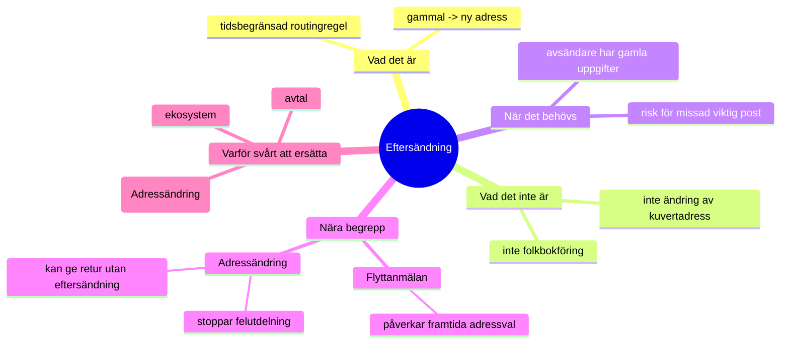

# Eftersändning av post i Sverige — hur det funkar (och varför vissa “har företräde”)

Det här dokumentet handlar enbart om **eftersändning** och närliggande begrepp som ofta blandas ihop: **flyttanmälan (folkbokföring)** och **adressändring**.

---

## 1) Begrepp (kort och praktiskt)

### Flyttanmälan (folkbokföring)
- Du anmäler till Skatteverket var du bor.
- Påverkar vilka adresser myndigheter och många aktörer kan hämta “officiellt” över tid.
- Löser inte automatiskt post som redan skickas till din gamla adress.

### Adressändring (tjänst)
- En registrering att du inte längre ska få post utdelad på den gamla adressen.
- Utan eftersändning innebär det ofta att post adresserad till gamla adressen i stället **returneras till avsändaren** (minskar felutdelning).

### Eftersändning
- En **tidsbegränsad routingregel**: post som fortfarande är adresserad till din gamla adress kan dirigeras om till din nya under en period.
- Syftet är att “fånga upp” avsändare som inte hunnit uppdatera din adress i sina system.

---

## 2) Flöde: var i kedjan eftersändning påverkar

```text
(1) Avsändare skapar brevet
    - Avsändaren väljer adress (ofta från sitt kundregister)
    - Adressen trycks på kuvertet
           |
           v
(2) Postoperatör tar emot & sorterar
    - Sortering sker huvudsakligen på postnummer/gata (det som står på kuvertet)
           |
           v
(3) Utdelningsled: kontroll mot flytt/routing
    A) Ingen eftersändning aktiv
       -> Brevet delas ut på adressen på kuvertet

    B) Eftersändning aktiv
       -> “Gammal adress -> Ny adress” används under eftersändningsperioden
       -> Brevet dirigeras vidare till den nya adressen
           |
           v
(4) Leverans
    - Ny adress (om eftersändning)
    - Annars: gamla adressen (eller retur vid adressändring utan eftersändning)
```

Viktigt: **eftersändning ändrar inte vad som står på kuvertet**; den påverkar var posten levereras genom en routingregel hos/kring operatörernas utdelningsprocess.

---

## 3) Varför “vissa har företräde” (prioritering i praktiken)

Det är inte en “hierarki” av tjänster, utan olika mekanismer som verkar i olika steg:

1) **Det som står på kuvertet** är alltid basen.
2) **Eftersändning** (om aktiv) kan överstyra leveransadress under en period.
3) **Adressändring utan eftersändning** handlar ofta om att stoppa felutdelning och kan leda till retur till avsändaren.
4) **Flyttanmälan/folkbokföring** påverkar främst avsändarnas framtida adressval (när de uppdaterar sina register) – inte routing av ett redan adresserat brev.

Så det som upplevs som “företräde” är att:
- Eftersändning påverkar *leveransen* här och nu,
- medan folkbokföring påverkar *framtida* adressdata hos avsändare.

---

## 4) Varför eftersändning finns (och varför den kostar)

- Många avsändare uppdaterar inte din adress direkt efter flytt.
- Eftersändning kräver extra hantering/routing i distributionsledet.
- Därför säljs det typiskt som en betaltjänst under en begränsad tid.

---

## 5) PostNord/Adressändring — varför det är svårt att “bygga en egen eftersändning”

I Sverige hanteras adressändring/eftersändning i praktiken via **Svensk Adressändring AB** som fungerar som en central aktör i ekosystemet.

Konsekvens:
- Att “konkurrera med eftersändning” är sällan bara teknik.
- Det kräver avtal/ekosystemåtkomst och samspel med operatörer.

---

## 6) Vad man kan göra i en flytt-assistent utan att ersätta eftersändning

Eftersändning är i grunden “en patch”. Ett bra komplement är att hjälpa användaren att minska behovet av patchen:

- **Checklista för adressuppdatering hos avsändare** (bank, försäkring, föreningar, e-handel)
- **Påminnelser efter 30/90 dagar** (“har du uppdaterat X?”)
- **Kvitto/attestering** (datum när användaren uppdaterade)

Detta konkurrerar inte med routing-ekosystemet, men ger mätbart värde.

---

## 7) Mindmap (översikt)


