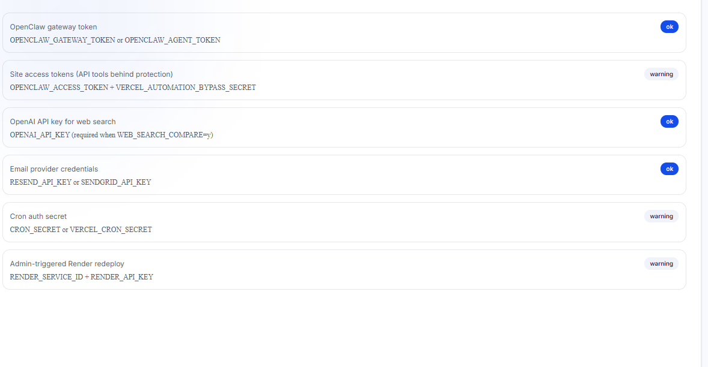
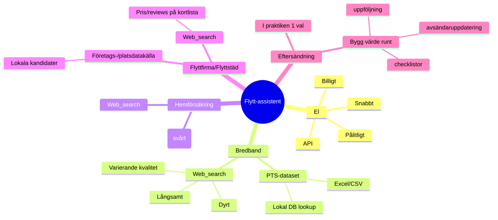
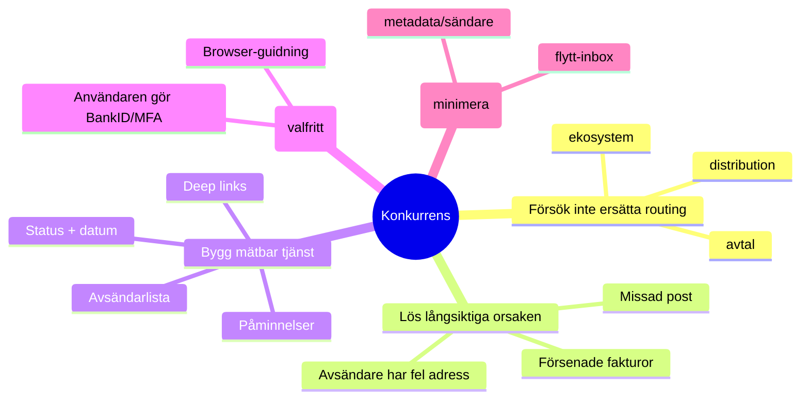

# Flytt-jämförelse: API vs web_search vs stubbar — sammanfattning

Det här dokumentet sammanfattar resonemanget kring vilka delar i en “flytt-assistent/jämförelsetjänst” som ger mest värde med **riktig data (API/dataset)**, vad som fungerar med **web_search**, och var **stubbar** i praktiken bara blir “hints”. Det inkluderar också ett rekommenderat sätt att konkurrera med befintliga partner-/aggregatorlösningar genom att bygga värde **runt** eftersändning och adressuppdatering.

---

## 1) Utgångsläge (din kontext)

### Vad som ger värde idag
- **El (API)**  
  Enda området med “riktig data” som är snabb, billig och robust.
- **Bredband, hemförsäkring (web_search)**  
  Fungerar men är långsamt (sekunder), kostar per anrop och kan vara opålitligt.  
  Bredband är mest värt att uppgradera men PTS har främst Excel/exports, inte ett enkelt REST-konsument-API.
- **Flyttfirma, flyttstädning (web_search)**  
  Tekniskt möjligt men kvaliteten blir ofta sämre: GPT hittar stora rikstäckande aktörer och missar lokala.  
  Kategorierna fungerar bättre som “tips/råd” än strikt prisjämförelse.
- **Stubbar (t.ex. eftersändning, magasinering, bredbandsteknik)**  
  Ger ofta bara hints. Eftersändning har i praktiken ett huvudalternativ och är därför sällan “jämförelse”.

### Realistiskt nästa steg
- Förbättra web_search-prompter för bredband/försäkring **eller** bygg en **PTS-datalookup** för bredband.
- För flyttfirma/städ: förbättra kvalitet genom att hitta lokala aktörer via företags-/platsdatakällor (API) och använda web_search först på en kortlista.

---

## 2) Vad går att “ro hem” relativt enkelt (utan stora partneravtal)

### 2.1 El
**Bra kandidat för riktig integration**
- Data kan hämtas maskinellt (t.ex. Nord Pool dataportal eller tredjeparts-API:er).  
- Resultat: låg latency, hög tillförlitlighet, bra uppdateringsfrekvens.

**Praktisk effekt**
- Du kan beräkna jämförpris / prognos / timpris-aggregering lokalt.
- Du kan minska beroendet av web_search nästan helt.

---

### 2.2 Bredband (PTS som dataset)
**Sannolikt bästa “nästa API-integration” i praktiken**  
PTS erbjuder ofta **nedladdningsbara Excel/CSV/dataset** som kan bli din “egen API” via lokal databas.

**Minimal lösning**
1. Schemalagd nedladdning av PTS-filer (t.ex. månadsvis/kvartalsvis).
2. Parse → normalisera → lägg i SQLite/DuckDB.
3. Bygg lookup: kommun/område/teknik/hastigheter.

**Fördelar**
- Snabbt (lokal query).
- Billigt (ingen tokenkostnad per fråga).
- Stabilt och förutsägbart.

**Nackdelar**
- Kräver initial datamodell + uppdateringspipeline.
- Adress-till-område-matchning kan vara knepig utan geokodning/fastighetsnycklar.

---

### 2.3 Flyttfirma / flyttstädning: “lokala aktörer”-problemet
Det stora kvalitetslyftet är:  
**Använd en företags-/platsdatakälla för att hitta lokala kandidater**, och använd web_search bara för att komplettera (pris/reviews) på en kortlista.

**Varför det funkar bättre än generisk web_search**
- “Flyttfirma + ort” i web_search tenderar att ge SEO-tunga aggregatorer och rikstäckande varumärken.
- En plats-/företagsdatabas kan filtrera på geografi, kategori, närhet.

**Resultat**
- Bättre recall på lokala företag.
- Lägre kostnad: web_search på 10–20 kandidater i stället för “hela webben”.

---

### 2.4 Hemförsäkring
**Det som låter enkelt är ofta partnerstyrt**
- Riktiga pris-API:er för försäkring är ofta låsta bakom partneravtal.
- Med web_search går det att få “good enough” men med risk för fel/utdaterat.

**Realistisk väg**
- Fortsätt med web_search + förbättrade prompar.
- Eller bygg partnerintegration (mer investerings-/juridiktyngd).

---

## 3) Eftersändning och “adressändring”: hur det faktiskt funkar (i flöde)

### 3.1 Tre saker som ofta blandas ihop
1) **Flyttanmälan (folkbokföring)**  
   Du uppdaterar var du bor. Det påverkar myndigheter och aktörer som hämtar adress från register över tid.
2) **Adressändring (stoppa felutdelning på gamla adressen)**  
   Utan eftersändning kan post med gammal adress ofta gå tillbaka till avsändare i stället för att delas ut fel.
3) **Eftersändning (tidsbegränsad routingregel)**  
   Post som fortfarande är adresserad till gamla adressen kan dirigeras om till nya under en period.

---

### 3.2 Flödesdiagram (routing)

```text
(1) Avsändare skapar försändelse
    - Tar adress från eget kundregister / registerkälla / tidigare uppgift
    - Skriver adress på kuvertet
           |
           v
(2) Postoperatör tar emot & sorterar
    - Sorterar primärt på postnummer/gata
           |
           v
(3) Utdelningsled: beslut om faktisk leverans
    A) Ingen flyttinfo/routingregel
       -> Levereras till adressen på kuvertet

    B) Adressändring utan eftersändning
       -> Minskar felutdelning på gamla adressen
       -> Ofta: retur till avsändare (beroende på typ av post)

    C) Eftersändning aktiv (tidsbegränsad)
       -> "gammal -> ny" under perioden
       -> Post dirigeras vidare till nya adressen
           |
           v
(4) Mottagare får post (ny adress, gammal adress eller retur)
```

---

### 3.3 “PostNordsamarbete”: varför eftersändning är svårt att konkurrera med direkt
- Adressändring/eftersändning i Sverige hanteras via **Svensk Adressändring AB**, som historiskt ägs av PostNord och CityMail och fungerar som central nod.  
- Operatörer kan få flytt-/eftersändningsinformation via denna centrala aktör.  
- Det betyder att “ersätta eftersändning” inte bara är teknik; det är ekosystem/avtal/distribution.

**Implikation**
- Det är oftast bättre att konkurrera **runt** eftersändning än att försöka ersätta den.

---

## 4) Hur man konkurrerar bra (utan att försöka ersätta nationell eftersändning)

### 4.1 Grundtanken
Eftersändning är en temporär patch. Det långsiktiga problemet är:
- **Avsändare har fel adress i sina system**.
- Användaren missar viktig post eller får försenade räkningar/krav.

### 4.2 Konkurrensstrategi: “Adressuppdatering + kontroll + bevis”
Bygg en tjänst som:
- Identifierar vilka avsändare användaren har (bank, försäkring, vård, medlemskap).
- Guidar användaren att uppdatera adress hos varje aktör.
- Sparar status och datum (“klar”, “kvar”, “verifierad”).
- Påminner efter 30/90/180 dagar.

**Värdet**
- Minskar behovet av eftersändning.
- Minskar risken att missa kritisk post.
- Skapar mätbar leverans (“X avsändare uppdaterade”).

---

## 5) OpenClaw/automation + e-post: möjligheter och integritet

### 5.1 Browser-automation (”human-in-the-loop”)
Du kan automatisera navigationen:
- Öppna rätt “ändra uppgifter”-sida.
- Steg-för-steg-guidning.
- Användaren gör BankID/MFA själv.

Det kan ge stor UX-vinst utan att du behöver “läsa allt”.

### 5.2 E-poståtkomst: vad man vinner och hur man minimerar intrång
**Vad man vinner**
- Auto-detektera avsändare baserat på avsändardomäner/metadata.
- Personlig todo-lista (inte generisk).

**Integritetsrisk**
- Innehåll i inbox kan vara mycket känsligt.

**Mindre intrång**
- Be användaren forwarda relevanta flytt-relaterade mail till en separat “flytt-inbox”.
- Eller använd snäva scopes: endast metadata/sökning på avsändare (om plattformen tillåter).

---

## 6) Rekommenderad prioritering (praktiskt)

1) **Bredband via PTS-dataset → lokal lookup**  
   Stabilt och billigt, minskar web_search-kostnad.
2) **Flyttfirma/städ: lokala aktörer via företags-/plats-API**  
   Största kvalitetsproblemet (missar lokala) löses bäst här.
3) **El: standardisera API-integration**  
   Om du vill ha jämn “riktig data”-nivå.
4) **Hemförsäkring**  
   Antingen förbättra web_search eller gå partneravtal (dyrt/tyngre).
5) **Eftersändning**  
   Inte jämförelsevärd; bygg värde runt den (checklistor, avsändaruppdatering, uppföljning).

---

## 7) Mindmaps (för överblick)

### 7.1 Produkt-/datakällor (mermaid mindmap)



### 7.2 “Konkurrera runt eftersändning”



---

## 8) Varför Markdown (.md) är ett bra format för LLM:er

- **Strukturerat men lättviktigt**: rubriker, listor, kodblock och citat ger tydliga “ankare” för både människor och modeller.
- **Förutsägbar parsing**: LLM:er hanterar tydliga sektioner och punktlistor bra; det minskar risken att modellen blandar ihop delar.
- **Kodbärare**: kodblock ```...``` bevarar indentering och gör att exempel kan kopieras direkt.
- **Diff-vänligt**: ändringar i .md blir tydliga i git; bra när man itererar prompar, policys och systemtexter.
- **Kan bära diagram**: t.ex. Mermaid-block för mindmaps/flowcharts, vilket är bra för att representera processer utan bilder.
- **Portabelt**: funkar i GitHub, wiki, editors, och kan konverteras till PDF/HTML.

---

## 9) Snabb “implementationsskiss” (utan kod)

- **Data layer**
  - `electricity_prices` (API)
  - `pts_broadband_dataset` (periodisk import)
  - `local_business_candidates` (plats-/företagsdata)
- **Decision layer**
  - Om dataset finns: använd lokal query
  - Annars: web_search (men på kortlista)
- **UX**
  - Checklistor + status + datum
  - Deep-links till “ändra adress”-sidor
  - Påminnelser

---

*Dokumentet är avsett att kunna användas direkt som systemdokumentation, prompt-underlag eller spec i repo.*
