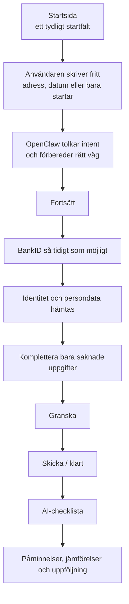
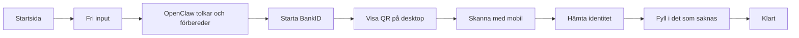
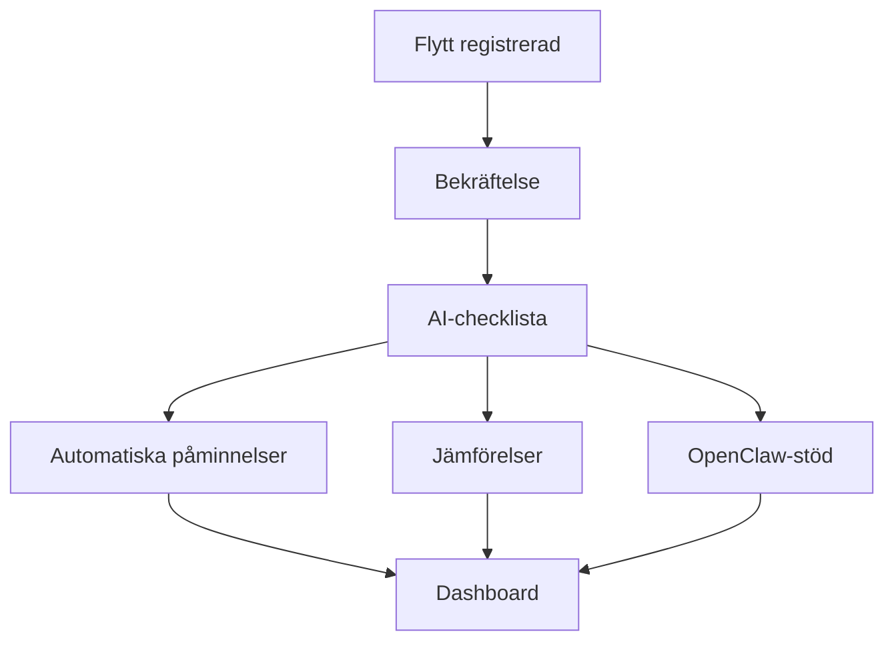

# Flytt.io - Vision, riktning och beslutsunderlag

> Det här dokumentet beskriver den frontendriktning som bäst matchar chefens material i `övrigt`, samtidigt som vi behåller nuvarande backend, sparlogik, API:er, checklistor, jämförelser, `OpenClaw` och routes-struktur.

---

## Executive Summary

### Huvudbeslut

Vi ska **inte** bygga ett helt nytt tekniskt frontendspår från noll.

Vi ska i stället göra en **tydlig redesign av den publika upplevelsen i det befintliga projektet**:

- behåll nuvarande backend, sparning och API:er
- behåll nuvarande app och routefundament
- bygg om startsidan och det publika adressändringsflödet så att det känns snabbare, tryggare och mer premium
- använd chefens visuella riktning som huvudsaklig designkompass
- låt `OpenClaw` vara med **från början** som backendhjärna och intelligenslager
- låt den visuella `DID`-flyttagenten vara användarens guide när hjälp behövs
- låt checklista, jämförelser, uppföljning och erbjudanden bli tydliga värden redan i löftet, men komma fullt ut **efter** att flytten registrerats

### Kort slutsats

Det bästa är:

**ny publik fasad, samma motor**

---

## North Star

Flytt.io ska kännas som:

- officiell
- snabb
- trygg
- modern
- intelligent

Användaren ska känna detta inom 5 sekunder:

> "Det här känns som det smartaste sättet att göra flyttanmälan. Jag kan börja direkt, få hjälp av AI och bli klar utan krångel."

---

## Chefens kärnvision

Utifrån `övrigt/flytt-wireframes.jsx`, `övrigt/FLYTT-WIREFRAMES-SAMMANFATTNING.md` och våra senaste beslut är chefens riktning i praktiken:

### Produktlöftet

- officiell flyttanmälan till `Skatteverket`
- trygg identifiering med `BankID`
- enkel start
- snabbt till klart resultat
- smart eftervärde efter flytten

### Vad som ska kännas i produkten

- mindre myndighetskrångel
- mer modern hjälp
- tydligt AI-stöd utan att bli tekniskt svårt
- få steg
- tydlig väg mot "klart"
- känslan av att tjänsten fortsätter hjälpa användaren efter registreringen

### Viktiga byggstenar från chefens material

- marin mörk textton: `#1A1A2E`
- mintgrön accent: `#7EE8A2`
- BankID-blå: `#235971`
- ljus ren bakgrund
- tydlig CTA
- "officiellt, gratis, tryggt, snabbt"
- ett starkt stödvärde: AI-checklista, påminnelser, uppföljning och jämförelser

---

## Hur bossens input har format planen

Planen bygger inte bara på vad som råkar vara lätt att bygga i nuvarande kodbas, utan på vad bossens material faktiskt signalerar om affär, känsla och prioritering.

### Input vi har tagit in från bossen

- att sidan ska kännas som den riktiga `flytt.io`
- att uttrycket ska vara modernare, lugnare och mer förtroendeingivande
- att användaren ska komma snabbt mot ett klart resultat
- att `BankID` och `Skatteverket` ska ligga nära kärnan
- att checklistan och eftervärdet är viktiga delar av erbjudandet
- att färger, tonalitet och riktning i wireframen ska bevaras

### Varför bossens input väger tungt här

Bossens material verkar inte vara en färdig teknisk lösning, men det är en stark produkt- och varumärkesriktning. Därför använder vi det som styrande för:

- informationshierarki
- visuellt uttryck
- konverteringsflöde
- vad som ska ligga tidigt respektive senare i resan

### Slutsats

Det är just därför planen inte bara säger "städa upp nuvarande sida", utan:

- behåll motorn
- bygg om den publika upplevelsen
- använd bossens riktning som grund för design och prioritering

---

## Uppdatering av tidigare beslut

Följande justeras jämfört med föregående version:

### 1. AI ska inte tonas ned för mycket

AI är inte något som ska gömmas undan så mycket att sidan blir anonym eller gammaldags.

Tvärtom bör AI vara ett modernt värdeord i rätt dos:

- AI-checklista
- AI-hjälp vid flytt
- AI som sparar tid och pengar
- AI som hjälper dig hitta rätt tjänster efter flytten

Det viktiga är att AI presenteras som:

- användbart
- tryggt
- konkret

Inte som:

- abstrakt hype
- teknisk internfunktion

### 2. `OpenClaw` ska vara med från början

`OpenClaw` ska inte bara ligga efter flytten. Den ska finnas med redan i första delen av resan som:

- backendhjärna för registrering och orchestration
- stöd för att förstå användarens fria input
- stöd för att fylla i och föreslå rätt uppgifter tidigt

Det är viktigt att skilja på dessa två lager:

- `OpenClaw` = hjärnan bakom logik, förståelse, backendstöd och hjälpflöden
- `DID`-agenten = det visuella och mänskliga gränssnittet som lotsar användaren när problem eller frågor uppstår

### 3. Checklistan ska sälja in värdet redan på första sidan

Checklistan ska nämnas redan i första intrycket som ett värdelöfte:

- AI-checklista
- automatiska påminnelser
- uppföljning
- jämförelser
- möjliga besparingar
- exempelvis `2 mån gratis el`

Checklistan behöver alltså vara:

- ett **värdelöfte i toppen**
- ett **riktigt verktyg efter registreringen**

---

## Vad vi redan har som är värdefullt

Vi har redan mycket av det svåra:

### I frontend-strukturen

- `app/page.tsx` är redan modulärt uppbyggd
- `app/adressandring/page.tsx` innehåller redan riktig flödeslogik
- `app/dashboard/page.tsx` innehåller redan ett mer avancerat efterflöde

### I backend och API

- `app/api/move/route.ts`
- `app/api/checklist/template/route.ts`
- `app/api/compare/[taskKey]/route.ts`
- `app/api/openclaw/chat/route.ts`
- `app/api/ai/autofill/route.ts`
- `app/api/ai/validate/route.ts`
- `app/api/skv/int7/start/route.ts`
- `app/api/skv/int7/status/[jobId]/route.ts`
- `app/api/skv/clone/state/[jobId]/route.ts`
- `app/api/skv/clone/qr/[jobId]/route.ts`

### I produkten

- data sparas redan
- checklista genereras redan
- jämförelser finns redan
- `OpenClaw` finns redan
- SKV/BankID-spår finns redan
- dashboarden finns redan

Det vore därför ett misstag att kasta bort detta och börja om rent tekniskt.

---

## Vad som inte matchar chefens vision idag

Den nuvarande sidan har flera styrkor, men den lutar fortfarande åt ett mer "techigt demo-uttryck" än chefens material.

### Nuvarande uttryck

I `app/globals.css` står uttryckligen:

- "Nordic Tech palette - deep cobalt blue + warm gold accent"
- `--primary` lutar mot lila/blå tech-ton
- `--accent` lutar mot guld
- `--font-sans` = `Inter`
- `--font-heading` = `Space Grotesk`
- `themeColor` i `app/layout.tsx` är satt till `#d4a017`

### Chefens uttryck

Chefens wireframe lutar i stället åt:

- mörk marin
- mintgrön accent
- BankID-blå
- vit och ljus bakgrund
- `DM Sans` och `Playfair Display`
- lugn, modern editorial-känsla

### Det vi måste tona ned

- videobakgrund i hero
- rörliga elektronlinjer och bakgrundseffekter
- för många animationer samtidigt
- magnetiska knappar
- överdrivna showcase-element

### Det vi inte måste tona ned

- AI som värdelöfte
- modern känsla
- premium-känsla
- tydlig smarthet i upplevelsen

Slutsats:

**det är uttrycket och prioriteringen som ska ändras, inte hela systemet**

---

## Ny produktberättelse

Flytt.io ska inte bara sälja "flyttanmälan".

Flytt.io ska sälja:

### Ett snabbt slutresultat

- börja direkt
- identifiera dig
- komplettera minimalt
- bli klar snabbt

### Ett smart eftervärde

- AI-checklista
- automatiska påminnelser
- jämförelser
- uppföljning
- besparingar
- vardagsnytta efter flytten

Det här gör att sidan kan bära AI på ett naturligt sätt.

### Exempel på tonalitet

- "AI-checklistan som hjälper dig bli klar och spara pengar efter flytten"
- "Automatiska påminnelser, jämförelser och uppföljningar"
- "Hitta allt från bästa nätverksleverantören till bästa pizzerian i ditt nya område"

Det sista kan användas som en lekfull och minnesvärd sekundär rad, inte som huvudbudskap.

---

## Huvudflöde



---

## Rollfördelning i upplevelsen

### `OpenClaw`

`OpenClaw` ska vara med tidigt och ha en tydlig roll:

- vara backendhjärnan bakom registreringsresan
- förstå fri input från startsidan
- styra användaren vidare på rätt sätt
- agera intelligenslager bakom formulärhjälp
- bidra till att rätt uppgifter hämtas och fylls i tidigt

`OpenClaw` är alltså inte samma sak som agentens ansikte utåt. `OpenClaw` är kontrollagret, beslutslogiken och kopplingen mot backendnära hjälp.

### `DID`-agenten

`DID`-agenten ska fungera som ett visuellt stöd, inte som huvudflödet i sig.

Den kan:

- förklara nästa steg
- guida användaren
- spegla vad systemet gör
- bidra till att formuläret känns enklare och mänskligare

`DID`-agenten ska alltså uppfattas som hjälparen i fronten, medan `OpenClaw` är hjärnan i bakgrunden.

### `BankID`

`BankID` ska vara så nära start som möjligt, eftersom det är det tryggaste sättet att:

- hämta identitet
- minska manuell inmatning
- få upp personuppgifter tidigt

### Personuppgifter, tidig hämtning och TOS

Det ska vara en del av produktplanen att viktiga personuppgifter hämtas tidigt och effektivt där det är möjligt.

Detta ska också beskrivas tydligt i:

- användarvillkor
- integritetspolicy
- eventuella samtyckestexter i flödet

Det som bör förklaras juridiskt och kommunikativt är att uppgifter kan användas för att:

- identifiera användaren
- förifylla formulär
- skapa checklista och uppföljning
- möjliggöra relevanta jämförelser och erbjudanden när användaren godkänt detta

---

## "Skriv vad som helst" på startsidan

Det här är en bra idé, men ska definieras rätt.

### Syfte

Det fria fältet är till för:

- låg tröskel
- känslan av att man kan börja direkt
- ett modernt AI-drivet första steg

### Exempel på input

- "Storgatan 12 Stockholm"
- "Vi flyttar 1 juni till Malmö"
- "Börja flyttanmälan"
- "Flytt till Lund i augusti"

### Vad systemet ska göra

- försöka hitta ny adress
- försöka hitta datum om det finns
- annars behandla texten som ett startkommando
- låta `OpenClaw` avgöra bästa nästa steg

### Viktigt

**Det fria inputfältet är en konverteringsyta, inte sanningskälla för all data.**

Verifierad data ska fortfarande i möjligaste mån komma från:

- `BankID`
- verifierade formulärfält
- befintliga API-spår

---

## BankID och QR - nuläge, framtid och realistisk plan

### Långsiktig målbild

På sikt vill vi använda den officiella lösningen från `Skatteverket` när den finns tillgänglig för vårt spår.

Det här är den långsiktigt bästa vägen för:

- förtroende
- stabilitet
- teknisk hållbarhet

### Nuläge för test

Just nu finns ett testspår där QR klonas via extern `docker` / Playwright-baserad automation.

Detta är användbart för:

- utveckling
- intern testning
- verifiering av UX-flödet

Men det ska dokumenteras tydligt som:

- temporärt
- utvecklingsnära
- inte slutlig produktlösning

### Viktig realism

Det är inte säkert att automatisk kopiering av alla uppgifter in i rätt flöde kommer att fungera fullt ut i devtestspåret.

Därför behöver planen innehålla:

- ett optimistiskt testspår
- en tydlig fallback

---

## BankID/QR - rekommenderad strategi

### Spår A - Officiell framtida väg

- använd officiell `Skatteverket`-implementation när den finns
- gör detta till primär väg i produktion

### Spår B - Dev/test under tiden

- använd klonad QR via extern `docker`
- använd detta för test av UX och sekvens
- bygg inte produktstrategin på att detta är permanent

### Spår C - Fallback

Om automatisk ifyllning inte fungerar fullt ut:

- använd `BankID` för identitet där det går
- förifyll det som går
- låt användaren komplettera resten

Detta är fortfarande ett bra flöde, så länge användaren känner:

- att systemet hjälper
- att det går snabbt
- att det är tryggt

---

## Device-strategi

Desktop är just nu viktigare att beskriva detaljerat eftersom QR-spåret i praktiken hör hemma där i nuläget.

### Desktop

- användaren börjar på startsidan
- går vidare till verifieringsflöde
- ser `BankID`-QR i ett snyggt inline-kort
- skannar med mobilen
- systemet hämtar identitet och försöker förifylla
- användaren kompletterar bara det som saknas



### Mobil

Mobil ska absolut stödjas, men dokumentationen behöver inte överdriva den delen just nu innan slutligt `BankID`/QR-spår är implementerat.

Kort princip:

- samma designriktning
- samma löfte
- färre tekniska antaganden i nuläget

---

## QR-frågan - kan man göra den snyggare?

### Kort svar

Ja, men det beror på **vilken typ av QR-kod** det är.

### Om det är en egen QR-kod som vi genererar

Då går det ofta bra att:

- lägga logga i mitten
- använda rundade hörn
- använda brandade färger
- göra den mer levande visuellt

Så länge:

- kontrasten är hög
- felkorrigering används
- loggan inte täcker för mycket

### Om det är `BankID` / `Skatteverket` / extern klonad QR

Då bör vi vara mycket försiktiga.

Rekommendation:

- ändra **inte själva QR-mönstret**
- lägg inte logga över mitten om QR:n inte är vår egen
- designa i stället ett snyggt kort runt QR:n
- använd rubrik, ram, status, trygghetscopy och diskret branding runtom

Alltså:

**snygg behållare runt QR:n: ja**

**modifiera själva BankID-QR:n: troligen nej**

---

## Checklistan som värdelöfte

Checklistan ska heta just checklistan eller AI-checklistan beroende på tonalitetstest.

Det viktiga är att den på första sidan upplevs som ett starkt värde:

- sparar pengar
- sparar tid
- hjälper dig efter flytten
- påminner dig automatiskt
- följer upp vad som återstår
- visar vad som går att jämföra

### Exempel på hur det kan sägas

- "AI-checklistan som hjälper dig spara tusenlappar efter flytten"
- "Automatiska påminnelser, jämförelser och uppföljning"
- "`2 mån gratis el` och smarta rekommendationer efter att flytten är klar"

Checklistan ska därmed:

- nämnas redan i toppsektionen
- realiseras fullt ut efter att flytten registrerats

---

## Flöde efter registrerad flytt



Det här är rätt plats för:

- checklistan
- uppföljning
- `OpenClaw`-hjälp
- jämförelsespår
- partnererbjudanden
- lokal nytta

---

## Visuell riktning

### Chefens rekommenderade färgprofil

| Roll | Färg | Kommentar |
|---|---|---|
| Primär mörk text / nav | `#1A1A2E` | Chefens huvudton, trygg och vuxen |
| Primär accent | `#7EE8A2` | Mintgrön, vänlig men distinkt |
| BankID / identitet | `#235971` | Tydlig färg för verifiering och QR-steg |
| Bakgrund | `#FFFFFF` + ljus gradient | Ren och luftig |
| Stödgrå text | `#4B5563` / `#6B7280` | Sekundär information |

### Typografi

Chefens wireframe pekar mot:

- `DM Sans` för brödtext
- `Playfair Display` för rubriker

Nuvarande projekt använder:

- `Inter`
- `Space Grotesk`

### Beslut om designprofil

Vi bör styra om den publika sidan mot chefens visuella profil:

- bort från lila/guld-tech
- in i marin/mint/editorial
- behåll modernitet
- behåll AI-premiumkänsla

---

## Första sidan - vad som ska stå högst upp

Toppen av sidan ska bära fyra saker samtidigt:

### 1. Huvudlöftet

- officiell flyttanmälan
- snabbt till klart

### 2. Tryggheten

- `Skatteverket`
- `BankID`
- trygg hantering av personuppgifter

### 3. AI-värdet

- AI-checklista
- AI-hjälp
- uppföljning

### 4. Efternyttan

- påminnelser
- jämförelser
- besparingar

---

## Rekommenderad hero-copy

### Version A - trygg och tydlig

**Flyttanmälan som det borde fungera**

Gör din officiella flyttanmälan snabbt och tryggt med `BankID`. Få en AI-checklista med påminnelser, jämförelser och smart uppföljning efter flytten.

### Version B - tydligare AI-värde

**Gör flytten klar snabbare - med AI, BankID och smart uppföljning**

Börja med din nya adress. Vi hjälper dig genom registreringen och följer upp resten med en AI-checklista som kan spara både tid och pengar.

### Visuell notering till presentationen

I presentationsmaterialet används den inskickade `Aida`-bilden som visuell referens i hero/omslagsdelen för att tydliggöra den framtida agentrollen.

---

## Ny informationshierarki

### På startsidan

1. Hero med fri input
2. Trust-signaler
3. Kort "så funkar det"
4. Kort block om AI-checklistan
5. Social proof
6. FAQ
7. CTA igen

### I huvudflödet `/adressandring`

1. Intent från startsidan
2. `OpenClaw` som förståelse och stöd
3. `BankID` tidigt
4. förifyllning / komplettering
5. granskning
6. klart

### Efteråt i `/dashboard`

- AI-checklista
- jämförelser
- påminnelser
- uppföljning
- lokal nytta

---

## Vad som ska behållas intakt i backend

### Datalagring

All nuvarande lagring ska ligga kvar som den gör idag.

### API:er

Dessa ska i praktiken betraktas som bevarade kontrakt:

- `POST /api/move`
- `GET /api/move`
- `POST /api/checklist/template`
- `GET/POST /api/compare/[taskKey]`
- `POST /api/openclaw/chat`
- `POST /api/ai/autofill`
- `POST /api/ai/validate`
- `POST /api/skv/int7/start`
- `GET /api/skv/int7/status/[jobId]`
- `GET /api/skv/clone/state/[jobId]`
- `GET /api/skv/clone/qr/[jobId]`

### Vad som får ändras

- publik route-orkestrering
- stegens ordning
- hur tidigt `BankID` kommer
- hur `OpenClaw` kopplas in i början
- hur QR visas i UI
- hur startsidan skickar intent vidare

### Vad som inte ska brytas

- sparning av flytt
- checklista
- jämförelseintegrationer
- `OpenClaw`
- SKV-int7 / QR-mirroring
- dashboard

---

## Route-riktning

```mermaid
flowchart TD
    A[/] --> B[/adressandring]
    B --> C[/api/openclaw/chat]
    B --> D[/api/ai/autofill]
    B --> E[/api/skv/int7/start]
    B --> F[/api/move]
    F --> G[/dashboard]
    G --> H[/api/checklist/template]
    G --> I[/api/compare/taskKey]
```

Det här innebär:

- frontenden kan byggas om ganska fritt
- backend kan till stora delar lämnas orörd
- den största insatsen ligger i UX, sekvens och routekoppling

---

## Tydlig slutrekommendation

### Vi ska göra detta

- bygga om startsidan tydligt
- göra AI och `OpenClaw` till en naturlig del av första intrycket
- få in `BankID` tidigt i huvudresan
- använda nuvarande QR-testspår för utveckling medan officiell lösning väntas
- behålla backend, API:er, checklistor och jämförelser
- göra checklistan till ett tydligt värdelöfte redan på första sidan
- låta eftervärdet bli starkt efter att flytten registrerats

### Vi ska inte göra detta

- skapa ett helt nytt tekniskt projektspår
- kasta bort nuvarande API:er
- bygga produktstrategin på att den klonade QR-lösningen är permanent
- ta bort AI som modernt värdeord bara för att undvika "tech-känsla"
- låta startsidan bli övereffektad igen

---

## Slutord

Den bästa vägen framåt är inte "lite städning" och inte heller "börja om från noll".

Den bästa vägen är:

> **Bygg om den publika upplevelsen runt den motor vi redan har, och låt AI, OpenClaw och BankID bli en tydlig del av den nya premiumresan.**

Det ger oss:

- snabbare leverans
- mindre teknisk risk
- bättre matchning mot chefens vision
- starkare konvertering
- tydligare väg från startsida till `BankID` till klart resultat
- bättre grund för checklista, uppföljning och framtida officiell QR/BankID-lösning
